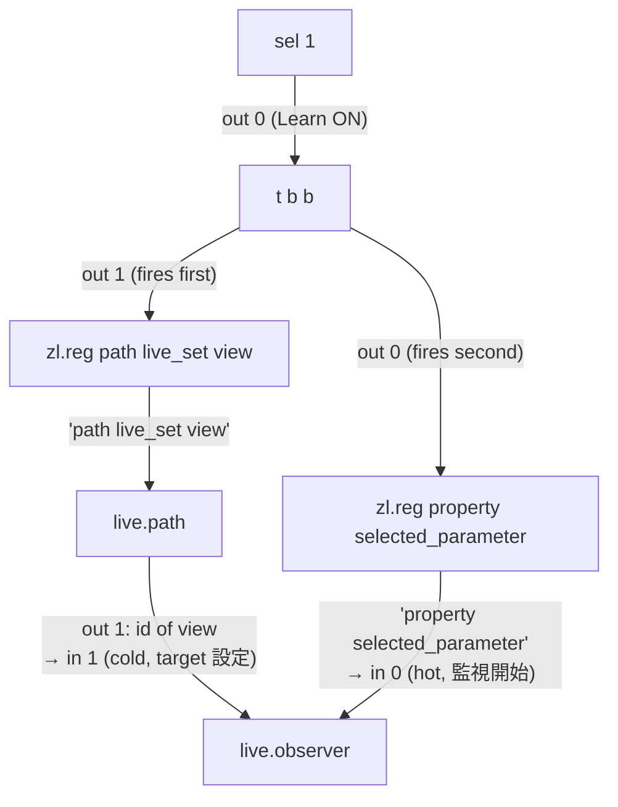
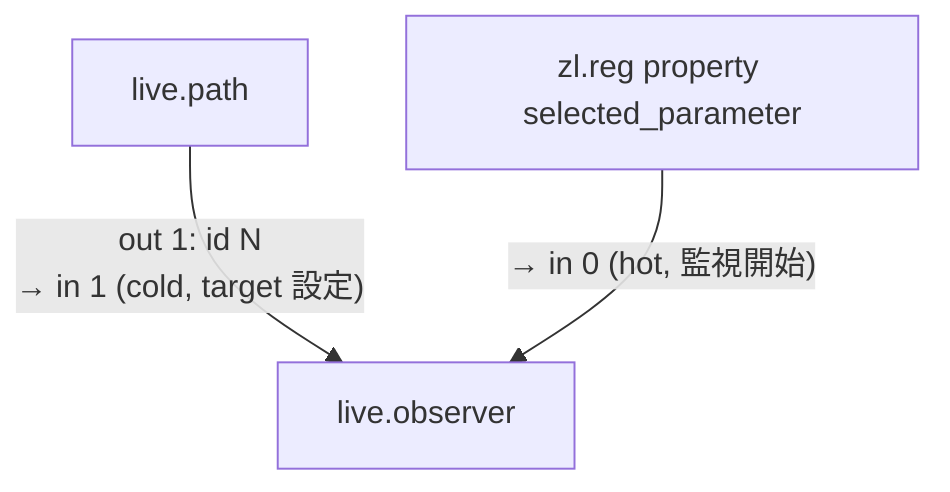
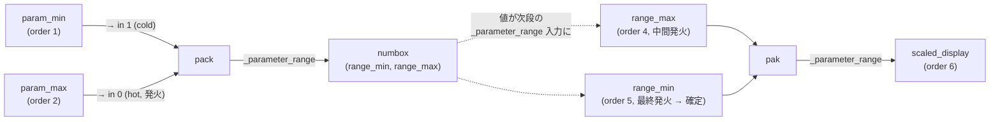

# M4L Coding Rules

Max for Live デバイス固有のコーディングルール。Live パラメータシステム、live.* オブジェクト、LOM 操作に関する規則。

## 🔴 必読: 全 Section に共通するアンチパターン

各 Section の規則を**読み飛ばすと発生する典型的な誤実装**:

| 違反 | Section | 症状 |
|---|---|---|
| `live.observer` の property を `message "property X"` で設定 | 1 | 編集中の誤クリック、右 inlet からの上書き、起動タイミング不明確 |
| `_parameter_unitstyle` を未設定（Float なのに 0 のまま） | 2 | UI で小数点以下が表示されず、操作精度が見えない |
| `pattr` の `parameter_enable` を未設定 | 3 | Live Set 保存時に値が永続化されない |
| `_parameter_invisible` を `2` (Hidden) にする | 3 | プリセット保存対象から除外されて値が失われる |
| Live 直接管理と pattrstorage を混在 | 5 | 復元順序の不整合、recall 時の不整合 |
| `_parameter_order` を未設定（デフォルト 0 のまま） | 6 | 復元順が不定、`_parameter_range` 設定前に値復元されてクランプされる |

すべての Section を**まず読み**、上記違反を起こさないよう設計に組み込む。

---

## 1. live.observer の property 設定

### 🔴 ルール: `zl.reg` を使う、`message` ボックスは禁止

`live.observer` の property は **必ず `zl.reg property <name>` パターンで設定**する。`@property` アトリビュート構文も `message "property <name>"` も使わない。

**✅ 正解:**



> `trigger` の出力順は **right→left** (out 1 が先発火)。先に path 解決して target id を `live.observer` の in 1 (cold) に設定し、その後で property メッセージを in 0 (hot) に送る。順序を逆にすると target 未設定で property が発火し、無効な観測になる。

**❌ 禁止 (1): `@property`**

```
add_max_object obj_type="live.observer" → 自動生成で @property を含めない
```

**❌ 禁止 (2): `message` ボックス**

```
sel 1 outlet 0 → message "property selected_parameter" → observer inlet 0
                  ↑ 編集中クリックで誤発火、右 inlet 上書き、起動タイミング不明確
```

**`@property` を禁じる理由**: `property` は `live.observer` の `<objarglist>` 定義（生成時引数）であり `<attributelist>`（アトリビュート）にないため、`@property` 構文の信頼性が不明確。

**`message` を禁じる理由**: 固定値の message ボックスは [execution-and-messaging.md](../../patch-guidelines/reference/execution-and-messaging.md) のアンチパターン参照。`zl.reg` で同等の機能をより安全に実現できる。

**パターン**:
- id 設定（右インレット）の後に `property <name>` メッセージを左インレットに送る
- これにより監視開始のタイミングが明示的になる



> 順序が重要: `in 1 (cold)` で id を先に確定させてから `in 0 (hot)` に property メッセージを送る。順序を逆にすると target 未設定で property が発火し、無効な観測になる。

**一般的な `@` アトリビュート設定との違い**: `@` 構文は Max 全般で有効なオブジェクト生成時のアトリビュート指定方法（Jitter 等でも多用）。`live.observer` の `property` が特殊なケースであり、`@` 構文自体は信頼性のある標準機能。詳細は patch-guidelines の [MCP Notes](../../patch-guidelines/reference/mcp-notes.md) を参照

## 2. live.* UI オブジェクトの unitStyle 設定

**ルール**: `live.dial` / `live.numbox` 等の live.* UI オブジェクトは、扱う値の型に応じて `_parameter_unitstyle` を明示的に設定する。

**理由**: デフォルトは `0`（Int 表示）のため、float 値（0.0〜1.0 等）を扱うオブジェクトでは小数点以下が表示されず、操作精度が分からない。

| unitstyle 値 | 表示形式 | 用途例 |
|---|---|---|
| 0 | Int | MIDIノート番号、整数パラメータ |
| 1 | Float | 0.0〜1.0 の連続値、カーブ指数 |
| 2 | Time | 時間値 |
| 3 | Hertz | 周波数 |
| 4 | deciBel | 音量 |
| 5 | % | パーセンテージ |

**ルール**: `_parameter_type` を Float (0) に設定した場合、`_parameter_unitstyle` も Float (1) に設定する。型と表示形式を一致させる。

## 3. pattr の parameter_enable 設定

**ルール**: M4L デバイスで `pattr` を永続化ストレージとして使用する場合、`parameter_enable 1` を設定する。

**理由**: `parameter_enable` が無効のままだと、pattr の値は Live のパラメータシステムに登録されず、Live Set の保存・復元時に値が失われる。

**設定項目**:

| アトリビュート | 値 | 説明 |
|---|---|---|
| `parameter_enable` | 1 | Live パラメータシステムに登録 |
| `autorestore` | 1（デフォルト） | パッチロード時に保存値を自動出力 |
| `_parameter_invisible` | 1（推奨） | Automapping に表示しない（内部保存用） |
| `parameter_mappable` | 0（推奨） | MIDI/キーボードマッピング対象から除外 |
| `_parameter_modmode` | 0 (None) | クリップモジュレーション無効（デフォルトは 4/Absolute） |
| `_parameter_speedlim` | — | デフォルト(1)のまま。内部保存用は影響なし |
| `_parameter_defer` | — | デフォルト(0)のまま。内部保存用は影響なし |

**`_parameter_invisible` の値の意味**:

| 値 | 名称 | 動作 |
|---|---|---|
| 0 | Automated and Stored | オートメーション可能、プリセット保存あり |
| 1 | Stored Only | オートメーション無効、プリセット保存あり |
| 2 | Hidden | オートメーション無効、プリセット保存なし |

内部保存用 pattr は `1` (Stored Only) を使用する。`2` (Hidden) にすると値が保存されなくなるため注意。

**`_parameter_range` の設定**:
- Float 型 pattr のデフォルト範囲は [0, 127]。LOM パラメータ値の格納には不足するため、十分広い範囲（例: [-100000, 100000]）を設定する
- 詳細は [pattr Range Limitations](../../max-techniques/reference/pattr-parameters.md#pattr-range-limitations) を参照

**注意**: `parameter_enable` はアンダースコアなし。`_parameter_range` 等の `_parameter_*` 系とは異なる命名規則。

## 4. live.dial の表示要素制御

**ルール**: live.dial のプレゼンテーション表示をコンパクトにする場合、`showname` / `shownumber` アトリビュートで表示要素を個別に制御する。

**理由**: live.dial はデフォルトでパラメータ名（shortname）と値（number）を表示する。コンパクトなUIでは表示スペースが限られるため、不要な表示要素を非表示にして省スペース化する。`_parameter_shortname` を空にする方法はパラメータシステムに影響するため推奨しない。

**アトリビュート**:

| アトリビュート | デフォルト | 説明 |
|---|---|---|
| `showname` | 1 | パラメータ名（shortname）の表示。0 で非表示 |
| `shownumber` | 1 | パラメータ値の表示。0 で非表示 |
| `appearance` | 0 (Vertical) | 表示スタイル。1=Panel, 2=Large |

**例**: パラメータ名を別の textedit で表示する場合、live.dial の `showname` を 0 にして重複を避ける。

## 5. パラメータ保存方式の選択（Live 直接管理 vs pattrstorage）

**ルール**: M4L デバイスのパラメータ保存方式は、Live のパラメータシステム直接管理と pattrstorage 管理のどちらかに統一する。混在させない。

**方式 A: Live 直接管理（プリセット不要なデバイス向き）**

```
Live Set (.als)
  \-- 各パラメータを直接保存 (live.* は自動、pattr は parameter_enable=1)
```

- live.dial / live.numbox / live.text → Live が自動保存
- pattr (parameter_enable=1) → Live が自動保存、autorestore で復元
- live.object (Persistent Mapping) → Live が id を永続化
- デバイスプリセットは Live の .adv ファイルを使用
- pattrstorage は不要

**方式 B: pattrstorage 一元管理（プリセット切替が必要なデバイス向き）**

```
Live Set (.als)
  \-- pattrstorage の状態を保存 (現在のプリセット番号、各プリセットの内容)
        \-- pattrstorage が各 pattr / autopattr の値を管理
```

- pattrstorage (greedy) + autopattr で全パラメータを管理
- live.* オブジェクトは `_parameter_invisible 2` (Hidden) にして Live のパラメータシステムから除外
- プリセット切替・補間（interpolation）が可能
- pattrstorage がプリセットの保存・復元を担当

**選択基準**:

| 条件 | 推奨方式 |
|---|---|
| プリセット機能が不要 | A（Live 直接管理） |
| デバイス内でプリセット切替が必要 | B（pattrstorage 管理） |
| パラメータ間の補間が必要 | B（pattrstorage 管理） |

**注意**: 方式 A と B を混在させると（一部を Live、一部を pattrstorage で管理）、保存・復元の順序やプリセット recall 時の不整合が発生する可能性がある。

## 6. _parameter_order による復元順序の完全定義

**ルール**: デバイス内の**全パラメータ**に `_parameter_order` を明示的に設定する。デフォルト（0）に任せない。

**理由**: Live のパラメータ復元はデフォルト（`_parameter_order = 0`）では順序が不定。`pack` / `pak` の発火構造や `_parameter_range` の依存関係により、復元順序が誤ると値がクランプされたり、downstream のチェーンが不完全に発火する。

**順序設計の原則**:

1. **`pack` を介する依存**: `pack` は inlet 0 のみ hot、他は cold。cold inlet に接続するパラメータを低 order、hot inlet (inlet 0) に接続するパラメータを高 order にすると、hot 受信時に全 cold 値が揃った状態で発火する。
2. **`pak` を介する依存**: `pak` は全 inlet が hot で、各 inlet 受信のたびに発火する。cold/hot のロジックは適用できないため、**チェーンの最終状態を確定させるパラメータを最高 order** に置く。それより前の order での発火は中間状態として許容され、最高 order の発火時点で全 inlet が正しい値で揃う。
3. **`_parameter_range` 供給 → 受領の順**: あるパラメータの復元が別の UI/pattr の `_parameter_range` を設定する場合、設定側 (供給) を低 order、受領側を高 order に置く。受領側が復元される時点で範囲が確定していないと値がクランプされる。
4. **独立パラメータは最後に** — 範囲・発火依存がないパラメータは後方の order に配置

**設定例** (ParameterMapper):



| order | 対象 | 理由 |
|---|---|---|
| 1 | param_min | pack cold inlet (inlet 1) に先に格納 |
| 2 | param_max | pack hot inlet (inlet 0) → 発火 → numbox の `_parameter_range` 設定 |
| 3 | param_name | パラメータ名表示（独立だが pattr グループとして早期復元） |
| 4 | range_max | pak の一方 inlet を先に更新（中間発火するが許容） |
| 5 | range_min | pak の他方 inlet を更新 → 最終発火で scaled_display の `_parameter_range` 確定 |
| 6 | scaled_display | 正しい `_parameter_range` 内で値を復元 |
| 7 | curve_n | scale inlet 5 (cold) に先に格納 |
| 8 | control_dial | scale inlet 0 (hot) → 発火 → target_obj |
| 9 | learn_toggle | 独立 |

**注意**:
- `_parameter_initial` は Live Set に保存値がない場合（初回追加時）のみ有効。既存の保存値が優先される
- pattr の `_parameter_initial` も同様に初回のみ有効。既存 Live Set でテストする場合はデバイスの削除→再追加が必要
- `_parameter_range` のデフォルト値は十分広い範囲（`[-100000, 100000]`）に設定し、復元時のクランプを防止する
