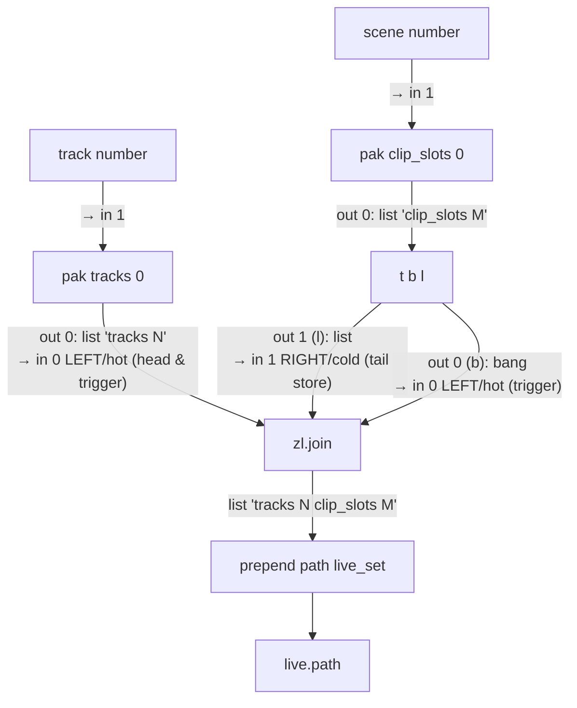
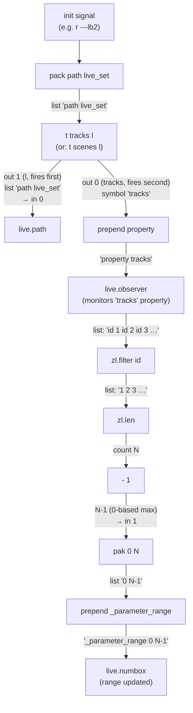
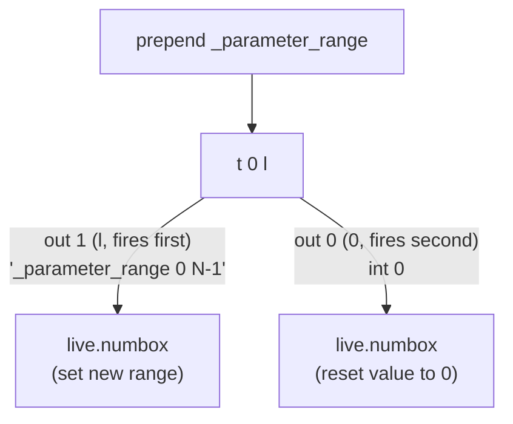
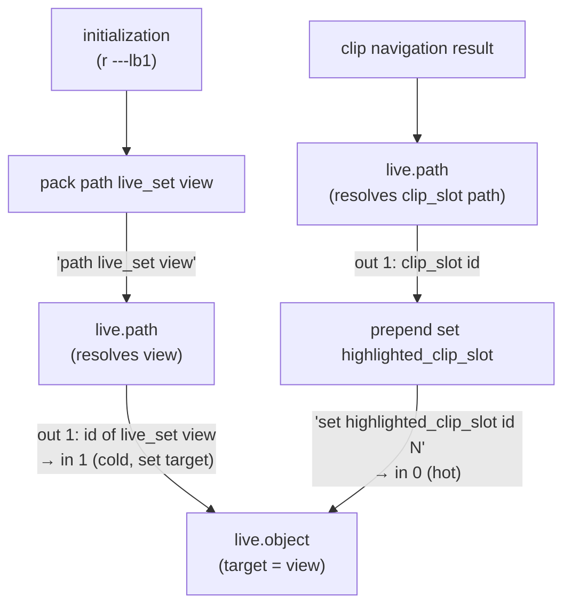
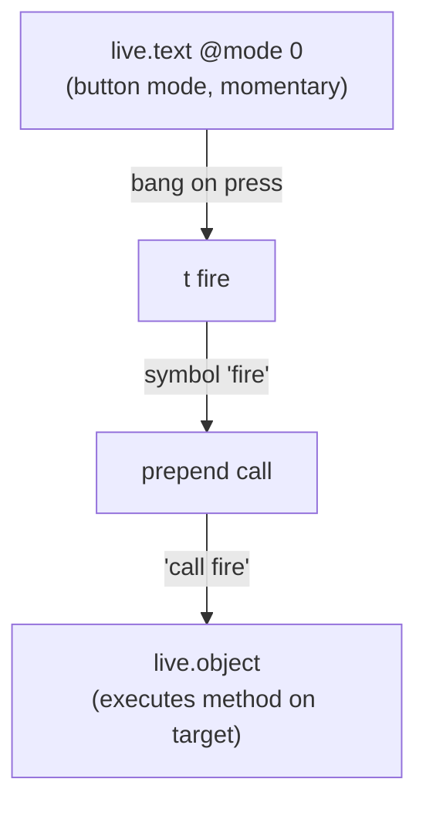

# LOM Applied Patterns

Reusable patterns for working with the Live Object Model in production Max for Live devices.
These patterns assume familiarity with the LOM pipeline covered in [Live Object Model Reference](live-object-model.md).

## 🔴 必読: アンチパターン

以下は LOM 関連で頻発する誤実装。**`live.object` / `live.path` / `live.text` を含むパッチを設計する前に必ず確認**。

### ❌ Anti-pattern 1: 固定 LOM メッセージを `message` ボックスで送る

```
message "call fire" → live.object        // ← 禁止
message "set value 0.85" → live.object   // ← 禁止
message "get min" → live.object          // ← 禁止
```

**症状**: 編集中にクリックして誤発火（クリップが意図せず再生される、パラメータが意図せず変更される）。右 inlet からの上書きでメッセージ内容が破壊される。

**正解**:

| ❌ message | ✅ 正解 |
|---|---|
| `message "call fire"` | `t fire → prepend call` |
| `message "set value 0.85"` (固定) | `t 0.85 → prepend set value` |
| `message "set value $1"` (動的) | `prepend set value`（上流から $1 を流す） |
| `message "get min"`、`message "get max"` 等の複数 | `t b b b → t name / t max / t min → prepend get` |

詳細は本ファイル末尾の "Why Not Use message?" セクション、および [execution-and-messaging.md](../../patch-guidelines/reference/execution-and-messaging.md) の Decision Tree 参照。

### ❌ Anti-pattern 2: `live.observer` の出力する list 内 `id` トークンを未処理

```
live.observer (tracks property) → zl.len  // ← "id 1 id 2 id 3" を 6 と数える
```

**症状**: トラック数のカウントが実数の 2 倍になる。

**正解**: `zl.filter id` で `id` トークンを除去してから `zl.len`。詳細は本ファイル「Dynamic Range via LOM List Counting」セクション。

### ❌ Anti-pattern 3: `live.text` で LOM メソッドを呼ぶのに toggle mode を使う

```
live.text @mode 1 (toggle) → t fire → prepend call → live.object
                                                       // ← OFF 時にも発火
```

**症状**: ボタンを離した時にも `call fire` が走り、クリップが二重発火する。

**正解**: 一度きりのメソッド呼び出しは `mode 0` (button mode = momentary)。詳細は本ファイル「live.text Button Mode + call Method」セクション。

### ❌ Anti-pattern 4: `live.path` 動的構築で `t b l` を省略

```
pak tracks 0 → zl.join (左inlet 直接) → ... // ← 左inlet が hot で発火、右inlet 未格納のまま
```

**症状**: 動的パスが正しく組み立たらない。タイミングにより毎回異なる結果。

**正解**: `t b l` で右 inlet (cold) → 左 inlet (hot) の順序を保証。詳細は本ファイル「Dynamic Path Construction」セクション。

---

## Dynamic Path Construction (pak + zl.join)

### The Problem

Building LOM paths like `live_set tracks N clip_slots M` where N and M change at runtime. Static paths only work for fixed targets.

### The Pattern



> mermaid flowchart には inlet/outlet を第一級ポートとして表現する記法がないため、エッジラベルで `out N → in M (hot/cold)` を明記している。

### How It Works

`zl.join` のセマンティクス: in 0 (左) は hot で head 兼トリガ、in 1 (右) は cold で tail を格納。新しい head が来ると即発火、bang が来ると保存済み head + tail で発火する。

1. `pak tracks N` は `tracks N` を生成 (`pak` は全 inlet hot のため、in 1 への新値で発火)
2. `pak clip_slots M` は `clip_slots M` を生成
3. **track 更新時**: `pak tracks 0` 出力 → `zl.join` in 0 → 新 head として保存しつつ即発火 → `tracks N clip_slots LAST_M`
4. **scene 更新時**: `pak clip_slots 0` 出力 → `t b l` で順序分離
   - `t b l` out 1 (l): `clip_slots M` を `zl.join` in 1 (cold) に格納
   - `t b l` out 0 (b): bang を `zl.join` in 0 (hot) に送信 → 保存済み head (`tracks LAST_N`) と新 tail で発火 → `tracks LAST_N clip_slots M`
5. `prepend path live_set` で `path live_set tracks N clip_slots M` を生成
6. `live.path` がフルパスを解決して ID を出力

### Key Insight

`zl.join` の in 0 (左/hot) には **2 経路から入力**が来る:

- `pak tracks 0` 出力 (list) — 新 head の格納と即発火を兼ねる
- `t b l` out 0 (bang) — 保存済み head と新 tail で発火させる

`t b l` の順序が critical な理由: bang を送る前に tail (`clip_slots`) を in 1 (cold) に格納する必要がある。`trigger` の出力順序は **right → left** (右の outlet が先) なので、`t b l` で l (右出力) が先に in 1 を更新し、b (左出力) が後で in 0 を発火させる。

### Generalization

This pattern works for any multi-segment LOM path:

```
path live_set tracks N devices M
path live_set scenes N
path live_set tracks N clip_slots M clip
```

Extend with additional `pak` + `zl.join` stages for deeper paths.

## Dynamic Range via LOM List Counting

### The Problem

A `live.numbox` for track/scene selection needs its range to match the actual number of tracks/scenes in the current Live set. The count changes when the user adds or removes tracks.

### The Pattern



> `live.path` の outlet 0 は path 文字列、outlet 1 は ID。本図では `prepend property → live.observer` の経路に焦点を当てている (id 出力は監視対象オブジェクトの解決に使われる)。

### How It Works

1. `live.observer` monitors the `tracks` property of `live_set`
2. When tracks change, observer outputs a list like: `id 1 id 2 id 3`
3. `zl.filter id` removes the `id` tokens, leaving: `1 2 3`
4. `zl.len` counts the items: `3`
5. `- 1` converts to 0-based max index: `2` (valid range: 0, 1, 2)
6. `pak 0 N` creates the range pair `0 2`
7. `prepend _parameter_range` sends `_parameter_range 0 2` to set the numbox range

### Why zl.filter id Is Needed

`live.observer` outputs ID lists in the format `id 1 id 2 id 3` (alternating "id" tokens and actual IDs). Without filtering, `zl.len` would return 6 instead of 3.

### Reset on Range Change

When the range shrinks (e.g., a track is deleted), the current value might exceed the new maximum. Use `t 0 l` after `prepend _parameter_range` to:



`trigger` の出力順は **right→left**。l (out 1) で先に新 range を適用し、その後 0 (out 0) で値を 0 にリセットすることで、新 range 内に値が収まることを保証する。

> 図中の `live.numbox` は同一オブジェクト(2 種類のメッセージを同じ inlet で受ける)。

This ensures the value is always within the valid range.

## highlighted_clip_slot Visual Feedback

### The Problem

When navigating clips from a Max device, the user has no visual indication in Live's Session View of which clip slot is currently selected.

### The Pattern



> `live.object` の右 inlet (in 1) は対象 ID 設定 (cold)、左 inlet (in 0) はプロパティ操作メッセージ (hot)。初期化で view の id を target に固定し、navigation 時に左 inlet に `set highlighted_clip_slot id N` を送ることで Live UI が反応する。

### How It Works

1. At initialization, resolve `live_set view` to get the Session View's object ID
2. Set this ID as the target of a `live.object`
3. When the user navigates to a new clip slot, resolve its path to an ID
4. Send `set highlighted_clip_slot <id>` to the `live.object`
5. Live's Session View highlights the corresponding clip slot

### Notes

- `highlighted_clip_slot` is a property of `live_set view`, not of individual clip slots
- The value is a clip slot ID (obtained from `live.path` outlet 1)
- This provides immediate visual feedback without launching the clip
- Useful for clip selectors, step sequencers, and navigation devices

## live.text Button Mode + call Method

### The Problem

Triggering a LOM method (like firing a clip) from a UI button requires converting a button press into a method call on `live.object`.

### The Pattern



### live.text Attributes

| Attribute | Value | Effect |
|-----------|-------|--------|
| `mode` | `0` | Button mode (momentary, outputs bang on press) |
| `mode` | `1` | Toggle mode (alternates between on/off states) |
| `text` | `"Launch"` | Label shown in off/default state |
| `texton` | `"Playing"` | Label shown in on/active state |
| `bgcolor` | `[r, g, b, a]` | Background color in default state |
| `activebgcolor` | `[r, g, b, a]` | Background color in active state |

### Generalization

Replace the trigger argument to call any LOM method:

```
t fire          → call fire          (launch clip)
t stop          → call stop          (stop clip)
t select_device → call select_device (select device in Live)
t jump          → call jump          (jump in arrangement)
```

### Why Not Use message?

A `message` box with `call fire` would work, but:
- Clicking the message box accidentally triggers the method
- The right inlet allows the content to be overwritten
- `trigger` + `prepend` is safer and more explicit

See the "Constant Parameters with trigger" pattern in the General Max/MSP Tips for more details.

