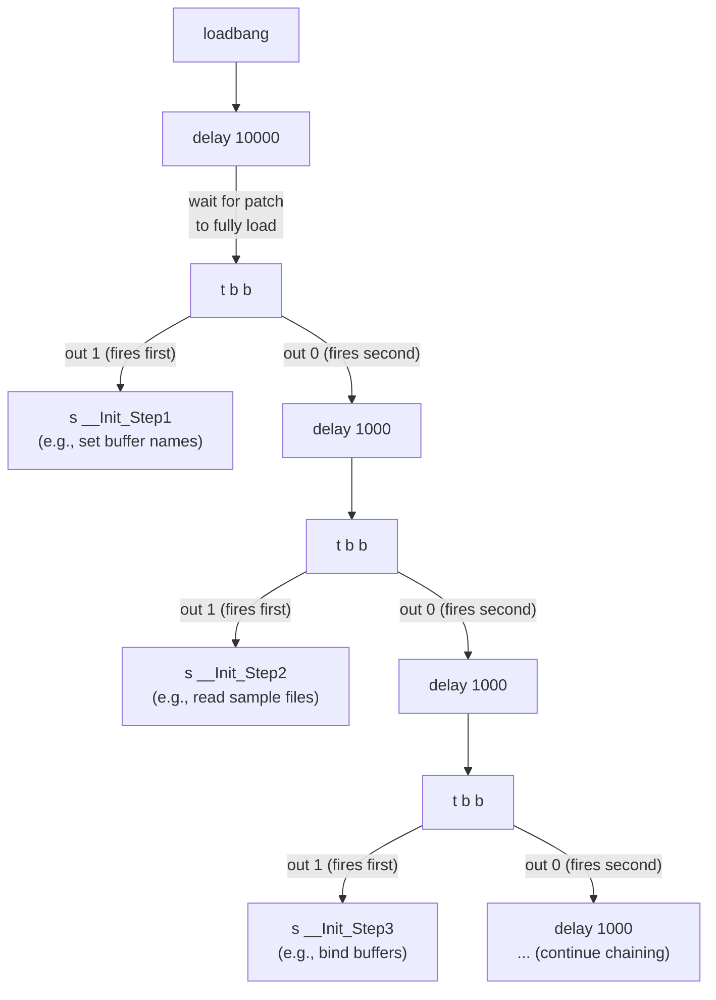
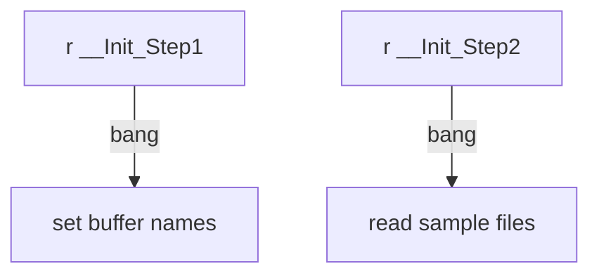

# Cascading Multi-Stage Initialization

> **M4L デバイスを構築する場合**: LOM (`live.path` / `live.observer` / `live.object`) を含む M4L デバイスは、`live.thisdevice` を起点とした初期化が必須。詳細と必読ルールは [m4l-techniques/SKILL.md](../../m4l-techniques/SKILL.md) の「🔴 MUST: LOM を使う M4L デバイスは `live.thisdevice` 必須」セクション、および [m4l-techniques/reference/tips.md](../../m4l-techniques/reference/tips.md) の Two-Stage Initialization を参照。

このドキュメントは **3 段階以上の汎用カスケード初期化パターン**(M4L 非依存も含む)を扱う。

## The Problem

Complex patches (especially standalone applications and installations) require multiple initialization steps that must execute in a specific order with timing gaps between them. For example: load configuration → read audio files → bind buffers → initialize parameters → start audio → start sequencer. Each step may need the previous step to complete before proceeding.

## The Pattern



## How It Works

Each stage follows the same `delay → t b b` building block:

1. `delay N` waits for the previous step to complete (N varies by step complexity)
2. `t b b` splits into two paths (right-to-left execution):
   - **Right outlet**: `send` broadcasts a bang to receivers for this step's work
   - **Left outlet**: triggers the next `delay` in the chain

Receivers anywhere in the patch respond to the broadcast:



## Key Design Decisions

**Why delay between steps?**
Some operations (file I/O, network requests, DSP setup) are asynchronous. A fixed delay ensures each step has time to complete before the next begins. Typical values: 1000ms for file operations, 5000-10000ms for network/audio setup.

**Why send/receive instead of direct connections?**
The broadcast pattern decouples the initialization chain from the work it triggers. Receivers can be placed anywhere in the patch hierarchy, and steps can be reordered or added without rewiring.

**Why loadbang + delay instead of immediate execution?**
The initial delay (e.g., `delay 10000`) ensures the entire patch is fully loaded before initialization begins. This is critical for standalone applications where subpatchers and externals may still be loading.

## Manual Triggers

Add `textbutton` objects connected to each `send` for manual re-triggering during development:

```
textbutton "Step 1"  →  s __Init_Step1
textbutton "Step 2"  →  s __Init_Step2
```

This allows testing individual steps without restarting the entire sequence.

## When to Use

- Standalone Max applications with complex startup requirements
- Installation patches that must initialize hardware, audio, and network in order
- Any patch with multiple asynchronous setup operations that depend on each other
- Patches that fetch data from external servers before playback

## Staircase Layout

When building the cascade chain in a patch, use a staircase layout where each `delay` → `trigger` → `send` triplet is offset down-right from the previous:

```
loadbang (x=1850, y=2264)
  ↓
delay → trigger (x=1850, y=2296)
  ├─→ send (long vertical, y≈3189)    ← init message 1
  ├─→ textbutton (nearby)             ← visual indicator
  └─→ next delay (x=1905, y=2351)     ← +55px right, +54px down
       ├─→ send (y≈3142)              ← init message 2
       └─→ next delay (x=1953, y=2406)
            └─→ ... (continues for N stages)
```

**Layout rules**:
- Each triplet offsets ~50px right and ~54px down (staircase visual)
- `send` targets are far below (dy > 500px), connected via long vertical straight lines
- `textbutton` indicators sit near each `send` target for visual confirmation
- Typically 4-8 stages in production patches

## M4L Variant

M4L devices use `live.thisdevice` instead of `loadbang`, and `---` namespace instead of global names:

| Aspect | Cascading Chain | M4L Two-Stage |
|--------|----------------|---------------|
| Trigger | `loadbang` | `live.thisdevice` |
| Stages | Unlimited (chain as needed) | Typically 2 (immediate + delayed) |
| Namespace | Global (`__Master_*` or similar) | Device-scoped (`---`) |
| Use case | Standalone apps, installations | M4L devices in Live |

For M4L の Two-Stage Initialization の詳細は [M4L Tips](../../m4l-techniques/reference/tips.md#two-stage-initialization-livethisdevice--delay) を参照。
