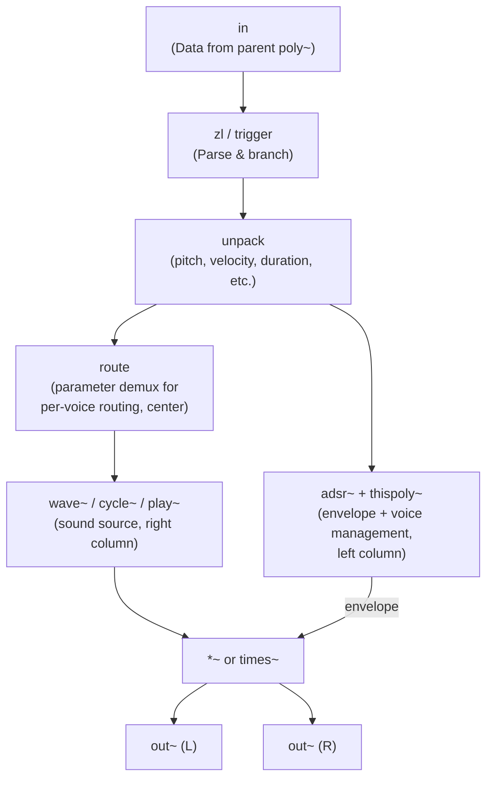
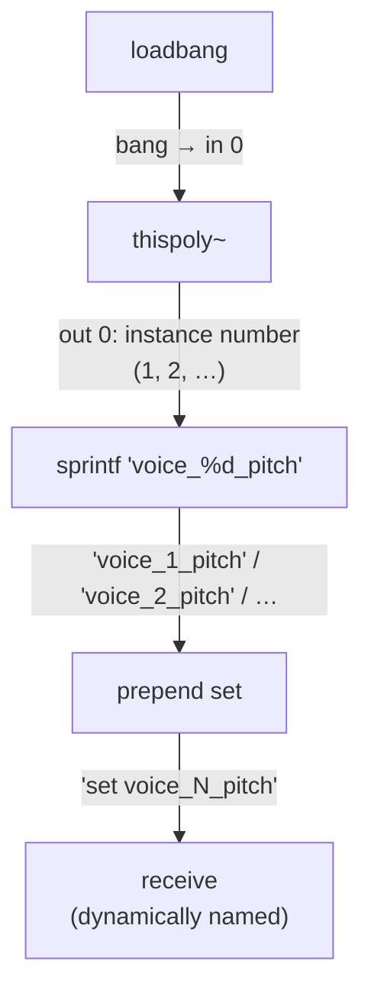
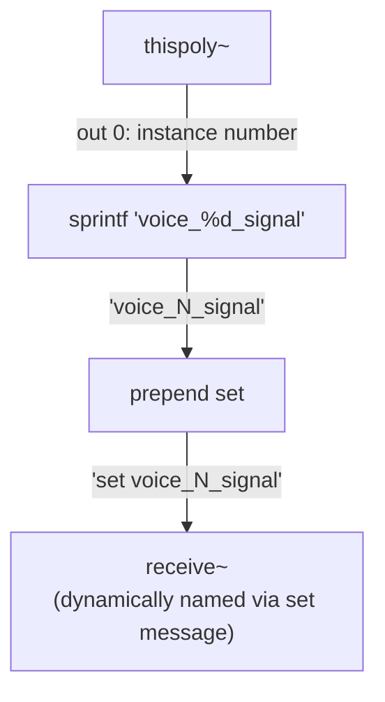

# poly~ Techniques

`poly~` を使った実践的テクニック集。基本仕様（arguments, inlets/outlets, target, thispoly~）は Max refpage を参照。

## Voice Subpatcher Template

ポリフォニックボイスの標準構造:



**Key conventions**:
- `in` at top, `out~` at bottom
- `thispoly~` near `adsr~` for mute-on-release (`adsr~` outlet 1 → `thispoly~` inlet 0)
- Use `loadmess` to set initial `thispoly~` state (e.g., steal mode)
- `thispoly~` can be placed multiple times — all report the same voice number and share the same mute state

## Instance-Specific Messaging

`target` を使わずに個別ボイスと通信するパターン。

### thispoly~ + sprintf + forward/receive

サブパッチャー内:



> `thispoly~` の outlet 0 が Instance Index、outlet 1 が Mute Flag、outlet 2 が Total voice count。`bang` を受けて outlet 0 から instance number を出力する。

オーディオ信号の場合は `send~`/`receive~` + `set` message:



親パッチからは `forward` で送信:

```
forward voice_1_pitch    → sends to voice 1
forward voice_3_pitch    → sends to voice 3
```

**Advantage**: `target` のボトルネックなしに真の並列ボイス通信が可能。

## Communication Hierarchy (3 Layers)

複雑な poly~ アーキテクチャでは3つの通信レイヤーを使い分ける:

### Layer 1: Global Broadcast (r __Master_*)

全ボイス・全インスタンスに届くグローバル `send`/`receive`。システム初期化や共有状態の変更に使用。

```
s __Init_BufferNames        ← all sampler voices everywhere respond
s __Init_ReadSamples        ← all voices load their samples
```

### Layer 2: Instance-Scoped (r #1_*)

引数ベースのプレフィックスで同一 poly~ インスタンス内の全ボイスが共有。他インスタンスからは隔離。

```
r #1_OriginKey              ← all 16 voices in this instance share the same base key
r #1_Start                  ← all voices use the same loop start
```

### Layer 3: Per-Voice (in N via target)

poly~ の voice allocation または `target` で個別ボイスにルーティング。

```
target 1, note 60 127    → instance 1 receives "note 60 127"
```

### Choosing the Right Layer

| Need | Layer | Mechanism |
|------|-------|-----------|
| System-wide init events | Global | `r __Master_*` |
| Per-instrument parameters (key, loop region) | Instance | `r #1_*` |
| Per-note data (pitch, velocity) | Per-voice | `in N` |
| Per-voice dynamic naming | Per-voice | `thispoly~` + `sprintf` |

## Argument Forwarding with Transformation

親サブパッチャーから子に引数を選択的に転送・結合・リナンバリングする。

### Concatenation

```
// Parent has #1 = "myProject"
mc.poly~ child_patch 16 @args #1_Sampler #2 #4
                               ↓          ↓  ↓
                          child #1     child #2  child #3
```

Child は `#1` = `"myProject_Sampler"` を受け取る。

### Selective Forwarding

全ての親引数を子に渡す必要はない。必要なものだけ選択:

```
// Parent: 5 arguments (#1-#5)
mc.poly~ child 16 @args #1_Sampler #2 #4
// Child receives only 3 args:
//   child #1 = parent #1 + "_Sampler"  (concatenated)
//   child #2 = parent #2              (forwarded)
//   child #3 = parent #4              (renumbered)
```

## mc.poly~ Caveats

`mc.poly~` (multichannel variant) has a known issue where MIDI messages are not processed unless the subpatcher contains at least one `out~` object.

**Workaround**: Always include `out~ 1` in `mc.poly~` subpatchers, even if audio output is not needed.

## Sources

- https://leico.github.io/TechnicalNote/Max/poly-summary
- https://leico.github.io/TechnicalNote/Max/poly-individual-signal
- https://leico.github.io/TechnicalNote/Max/poly-mc-problem
