# General Max/MSP Tips

Proven patterns for safe and reliable patch behavior. For foundational concepts and safe messaging patterns see [Execution Model & Messaging](../../patch-guidelines/reference/execution-and-messaging.md).

## Sampling Rate Dependent Behavior

### The Problem

Filter cutoff frequencies that exceed the Nyquist frequency (half the sampling rate) cause DSP failure. For example, a 30kHz high-pass filter at 44.1kHz sampling rate (Nyquist = 22.05kHz) can freeze the entire DSP chain.

### The Solution: dspstate~

`dspstate~` reports the current audio configuration:

- **Outlet 0**: Signal (1.0 when DSP is on, 0.0 when off)
- **Outlet 1**: Current sampling rate (integer, e.g., 44100, 48000, 96000)
- **Outlet 2**: Signal vector size

### Adaptive Filter Pattern

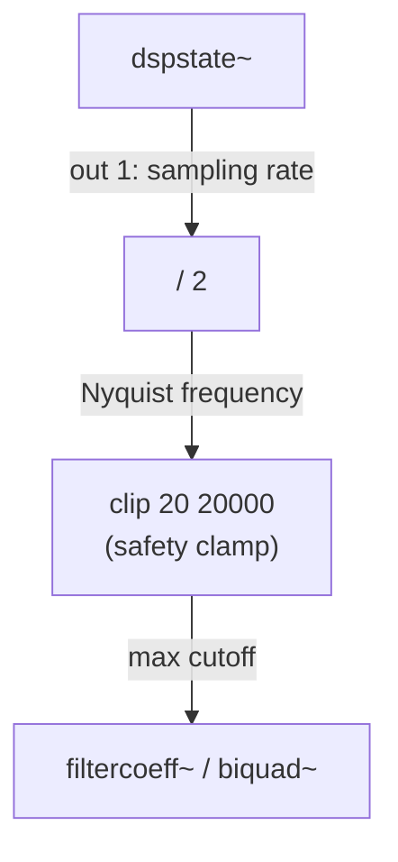

**Practical implementation**:

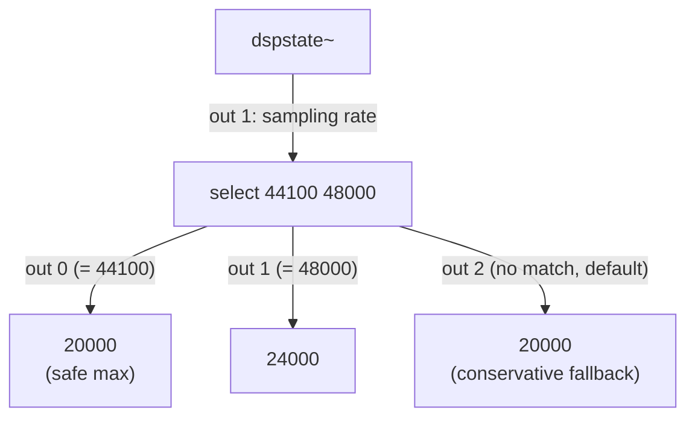

**Rule of thumb**:
- Sampling rate < 48kHz → limit high-frequency parameters to 20kHz
- Sampling rate >= 48kHz → can safely extend to 24kHz
- Always provide a conservative default for unknown rates

### When to Use

- Any patch with user-controllable filter cutoff frequencies
- Patches that may run at different sampling rates (e.g., shared patches, multi-interface setups)
- Patches using `filtercoeff~`, `biquad~`, `svf~`, or other filter objects with frequency parameters

## Increment/Decrement Counter Pattern

### The Problem

A common UI need: two buttons (up/down or left/right) that adjust a shared counter. Building this naively requires duplicating the counter logic for each button.

### The Pattern

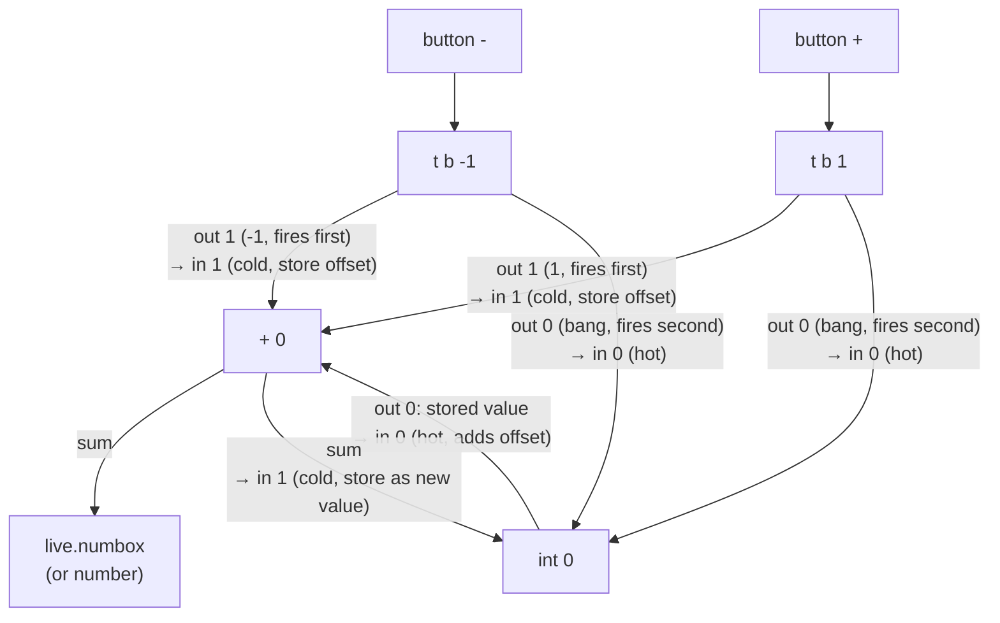

### How It Works (Hot/Cold in Action)

Each button triggers a `trigger` that outputs a bang and an offset value:

1. **Right outlet fires first** (cold inlet path):
   - `t b -1`: sends `-1` to `+` right inlet (cold — stored, no output)
   - `t b 1`: sends `1` to `+` right inlet (cold — stored, no output)

2. **Left outlet fires second** (hot inlet path):
   - Bang goes to `int` left inlet (hot — outputs stored value)
   - `int`'s output flows to `+` left inlet (hot — adds stored offset, outputs sum)
   - Sum flows to display AND back to `int` right inlet (cold — stored as new value)

### Key Insight

Both `t b -1` and `t b 1` share the same `int` and `+` objects. This works because:
- The offset is set on the cold inlet before the bang triggers the hot inlet
- 4 objects total (2 triggers + 1 int + 1 add) handle bidirectional counting

### Bounds Checking

Combine with `clip` or `live.numbox` range to prevent overflow:

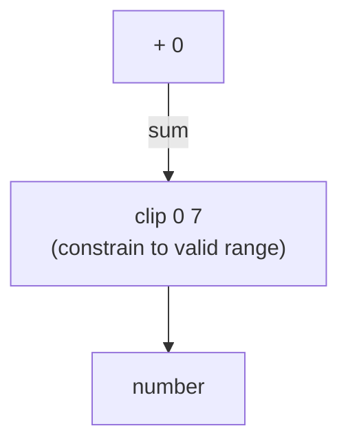

Or use `live.numbox` with `_parameter_range` to enforce bounds automatically.

## change Object for Feedback Loop Prevention

### The Problem

Circular connections (A → B → C → A) create infinite loops. This commonly occurs when:
- Two parameters need bidirectional synchronization
- A UI control both sends and receives from the same source
- LOM observer output feeds back to the observed property

### The Pattern

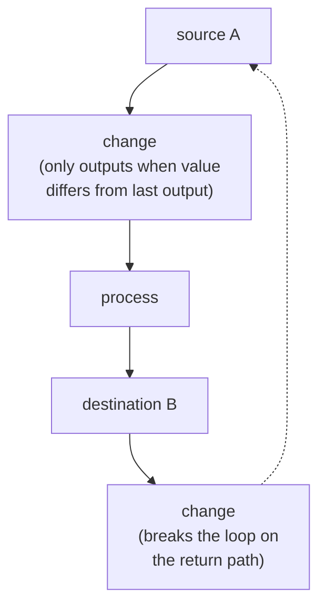

### How It Works

`change` stores the last value it output. When a new value arrives:
- **Different from stored**: Outputs the value and updates stored value
- **Same as stored**: Suppresses the output (no message passes)

This breaks infinite loops because the second traversal of the loop carries the same value, which `change` blocks.

### Choosing the Initial Value

引数なし `change` は使わない。常に初期値を明示する。

| 条件 | 使用 | 理由 |
|------|------|------|
| 最初の `0` を通過させなくてよい | `change 0` | デフォルトと同じだが型を明示 |
| 最初の `0` を通過させたい && 値が unsigned 確定 | `change -1` | `-1` は自然に発生しない |

```
change -1      ← initial stored value is -1, first 0 passes through
```

### Practical Example: Bidirectional Sync

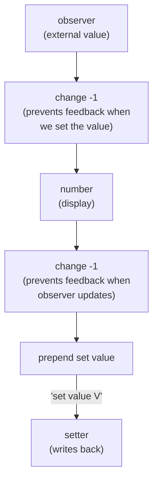

Without `change`, setting the value triggers the observer, which updates the number, which sets the value again — infinite loop.

### When to Use

- Bidirectional parameter binding (UI ↔ model)
- Observer + setter feedback paths
- Any circular signal flow where values stabilize after one round-trip
- Counter patterns where the output feeds back to the input (as in the Increment/Decrement pattern above)

## Cascading Multi-Stage Initialization

→ [cascading-init.md](cascading-init.md) に独立ドキュメントとして移動。

## closebang Cleanup Pattern

### The Problem

When a patch closes, active audio and held MIDI notes persist momentarily, causing clicks, stuck notes, or resource leaks. Without explicit cleanup, closing a patch can leave the audio system in an inconsistent state.

### The Pattern

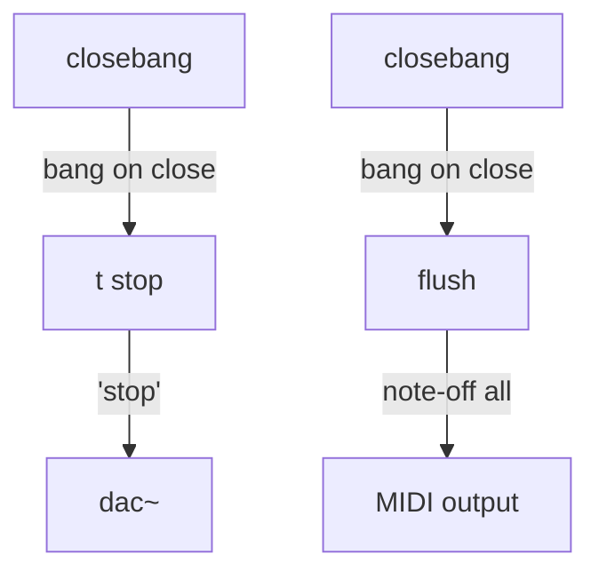

### closebang vs loadbang

| Object | Fires when | Use for |
|--------|-----------|---------|
| `loadbang` | Patch opens | Initialization |
| `closebang` | Patch closes | Cleanup |
| `freebang` | Object is deleted | Per-object cleanup |

### Common Cleanup Actions

| Action | Pattern | Purpose |
|--------|---------|---------|
| Stop audio | `closebang → t stop → dac~` | Prevent audio clicks on close |
| Release MIDI | `closebang → flush` | Send note-off for all held notes |
| Stop sequencer | `closebang → t stop → seq/seq~` | Halt playback |
| Stop metro | `closebang → t 0 → metro` | Stop timed processes |
| Stop network | `closebang → t stop → maxurl` | Cancel pending HTTP requests |

### Multiple Cleanup Actions

Use `trigger` to sequence multiple cleanup operations:

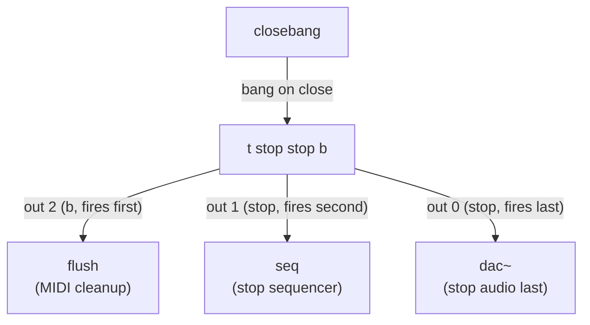

> `trigger` の出力順は **right→left**(out 2 → out 1 → out 0)。MIDI flush を最初に、audio 停止を最後にすることで、note-off メッセージが出力に届く時間を確保する。

**Order matters**: Stop audio last to allow MIDI note-offs to reach the output cleanly.

### When to Use

- Any patch with `dac~` (always add audio cleanup)
- Patches that send MIDI notes (prevent stuck notes)
- Patches with network connections (`maxurl`, `udpsend`)
- Patches with timed processes (`metro`, `qmetro`, `delay`)
- Standalone applications where clean shutdown is critical

## Output Safety Chain

### The Problem

Audio processing chains can produce unexpected level spikes, DC offset, or clipping — especially when using dynamic effects (compressors, distortion) or sample playback with varying source levels. Without output protection, these can damage speakers or cause distortion.

### The Pattern

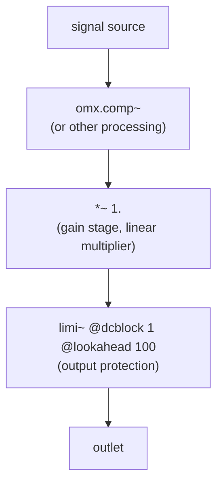

The gain value comes from a dB-to-linear conversion:

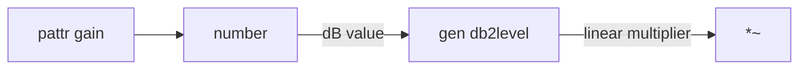

### How It Works

1. **`gen db2level`**: Converts a dB value to a linear multiplier (e.g., -6dB → 0.5, 0dB → 1.0)
2. **`*~`**: Applies the linear gain to the signal — safer than `*~` with raw dB values
3. **`limi~`**: Lookahead limiter prevents output from exceeding 0dBFS
   - `@dcblock 1`: Removes DC offset that can accumulate through processing
   - `@lookahead 100`: 100ms lookahead for transparent limiting (no audible pumping)

### Why This Order

| Stage | Purpose |
|-------|---------|
| Gain (`*~`) first | User-controlled level adjustment before limiting |
| Limiter (`limi~`) last | Catches any peaks the gain stage doesn't anticipate |

Placing the limiter after gain ensures the output never clips regardless of gain setting.

### Stereo Configuration

For stereo output, duplicate the chain for each channel:

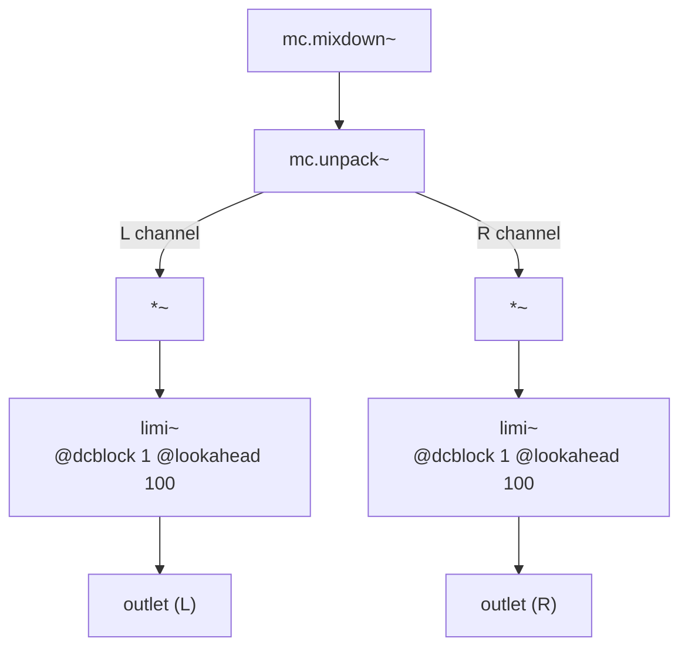

> 両チャンネルの `*~` は同じ `gen db2level` 出力を共有する。

Both channels share the same gain source (`gen db2level` output).

### When to Use

- Any patch with audio output (`dac~`, `outlet~`, `mc.send~`)
- After dynamic processing (compressors, distortion, waveshaping)
- Sample playback with unknown source levels
- Live performance patches where clipping is unacceptable

## Normalized Parameter Interface

### The Problem

Audio effect objects (e.g., `omx.comp~`) accept parameters in different ranges (threshold: 0-100dB, ratio: 0-100, attack: 0-150ms, release: 0-150ms). When exposing these parameters via `pattr` for preset management or external control, each parameter needs different range handling, making the interface inconsistent.

### The Pattern

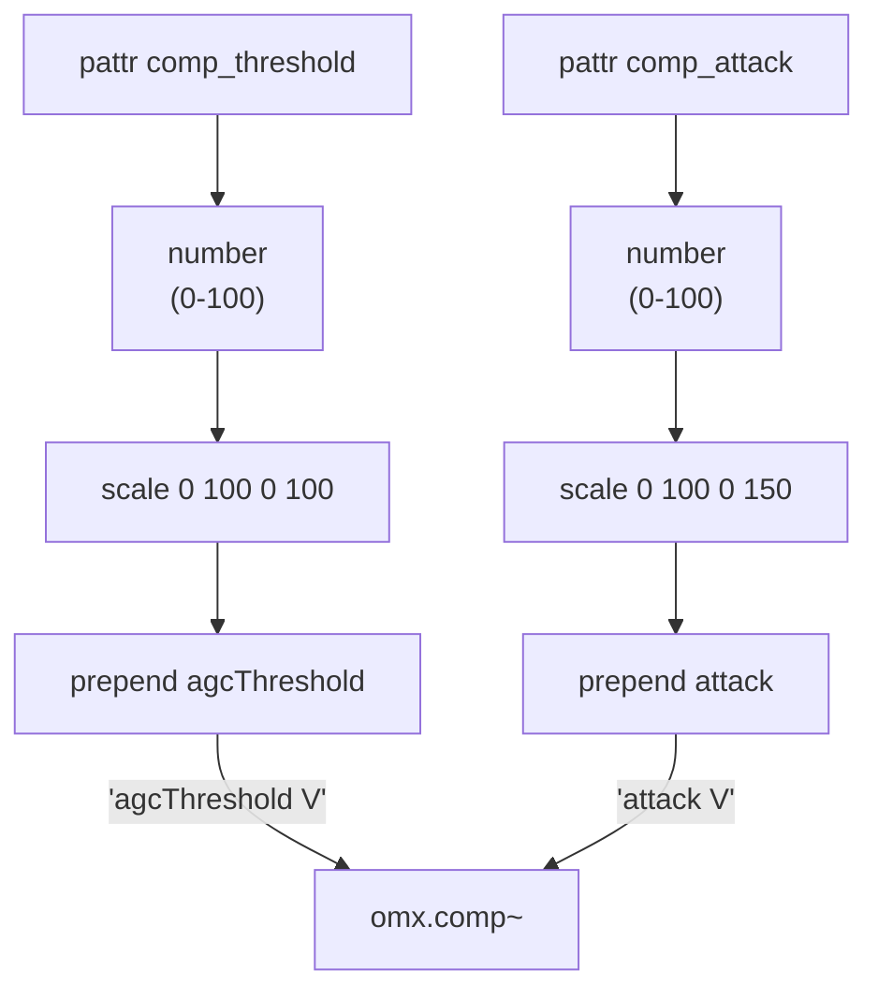

### How It Works

1. **`pattr`**: Stores normalized 0-100 value, exposed to `pattrstorage` for presets
2. **`number`** with `minimum`/`maximum` attributes: Clamps the value to the valid range (e.g., 0-100) and displays it to the user. This prevents out-of-range values from reaching downstream processing
3. **`scale 0 100 0 <actual_max>`**: Maps normalized range to the target object's actual range
4. **`prepend <param_name>`**: Formats as a message the target object understands

### Input Clamping with number

The `number` object's `minimum` and `maximum` attributes serve as the input guard:

```
number @minimum 0 @maximum 100    ← normalized parameters (comp, etc.)
number @minimum -70 @maximum 12   ← dB gain (-70dB to +12dB)
```

This clamping is essential — without it, values from `pattr` recall or external controllers could exceed the expected range, causing unexpected behavior in `scale` or downstream objects. The `number` object enforces bounds at the UI level before any processing occurs.

### Key Design Decisions

**Why normalize to 0-100?**
- All parameters share the same input range → consistent UI
- External controllers (MIDI CC, OSC) naturally map to 0-127 or 0-100
- Preset interpolation works uniformly across all parameters
- Parent patches can control all parameters with identical logic

**Why `scale` instead of direct range in `pattr`?**
- `pattr` range settings (Parameter Inspector) are hidden and easy to forget
- `scale` makes the mapping visible and editable in the patch
- Easy to adjust ranges without opening Inspector dialogs
- Multiple parameters can use different target ranges with the same source range

### Extending the Pattern

For parameters that need non-linear mapping (e.g., logarithmic frequency):

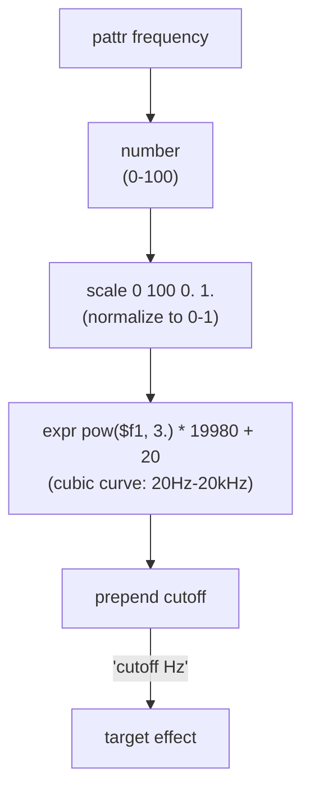

### When to Use

- Wrapping effect objects with multiple parameters (`omx.comp~`, `omx.peaklim~`, etc.)
- Subpatchers that expose parameters to parent patches via `pattr`
- Any patch where external control (MIDI, OSC, pattrstorage) needs uniform ranges

## Numbered Sample File Loading

### The Problem

Sample-based instruments need to load one file from a set of numbered audio files (e.g., `Piano_01.wav` through `Piano_12.wav`). The selection may be random, sequential, or externally controlled. Building this with message boxes is fragile and hard to maintain.

### The Pattern

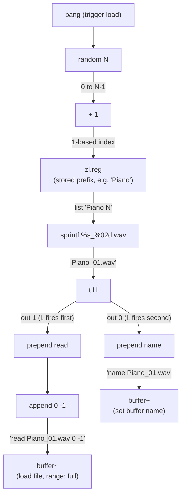

### How It Works

1. **`random N` + `+ 1`**: Generates a 1-based index (1 to N). Use `+ 1` because `random N` outputs 0 to N-1
2. **`zl.reg`**: Stores the filename prefix, outputs it as a list when banged. The prefix is set during initialization via `send`/`receive`
3. **`sprintf %s_%02d.wav`**: Combines prefix + zero-padded index into a complete filename
4. **`t l l`**: Splits into two paths — file loading and buffer naming
5. **`prepend read` + `append 0 -1`**: Sends `read <filename> 0 -1` to `buffer~` (load entire file)
6. **`prepend name`**: Sets the buffer's reference name for other objects (`waveform~`, `groove~`)

### File Naming Convention

The pattern expects zero-padded numbered files:

```
<prefix>_01.wav
<prefix>_02.wav
...
<prefix>_12.wav
```

Adjust the `sprintf` format for different naming:
- `%s_%02d.wav` → `Piano_01.wav` (2-digit zero-padded)
- `%s_%03d.wav` → `Piano_001.wav` (3-digit)
- `%s_%d.wav` → `Piano_1.wav` (no padding)
- `%s-%d.aif` → `Piano-1.aif` (different separator and format)

### Initialization Integration

Combine with the [Cascading Multi-Stage Initialization](cascading-init.md) pattern:

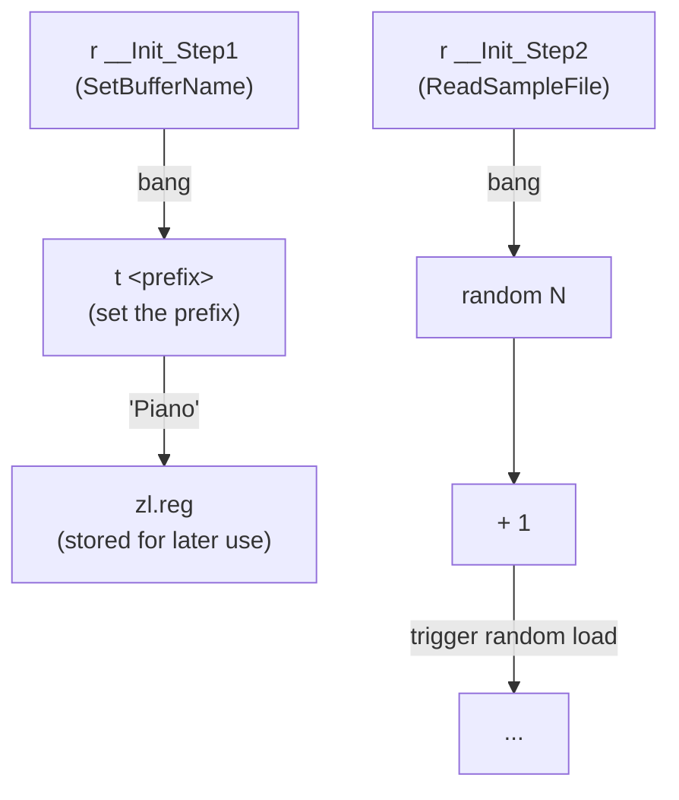

### When to Use

- Sample-based instruments with multiple sound variations
- Drum machines with randomized sample selection
- Granular synthesis with numbered grain files
- Any patch that manages a numbered collection of audio files

## dac~ / adc~ Consolidation

### The Issue

`dac~` and `adc~` can be placed multiple times in the same patch — all instances sharing the same channel numbers will route to the same audio hardware I/O. While technically valid, scattering multiple `dac~` or `adc~` objects across a patch makes signal flow harder to trace, especially when analyzing or modifying the patch programmatically.

### Recommendation

Consolidate audio I/O to a single location in the patch:

```
[all signal processing]
  +-- L channel
  \-- R channel
        |
      dac~ 1 2                  (single dac~ at the bottom of the output section)
```

If multiple sections need independent audio output control, route all signals to one `dac~` via `send~`/`receive~` rather than placing separate `dac~` objects in each section.

## Sources

- https://leico.github.io/TechnicalNote/Max/constant
- https://leico.github.io/TechnicalNote/Max/separate-samplingrate
- Production M4L device analysis
