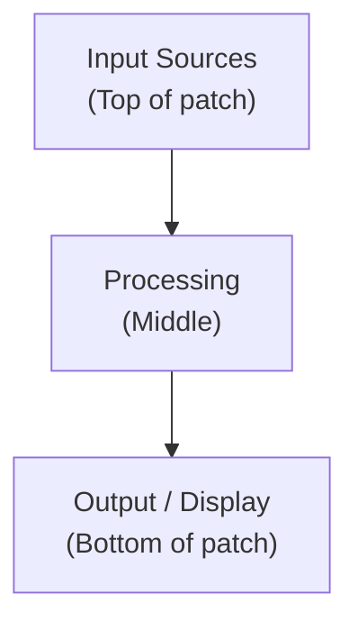
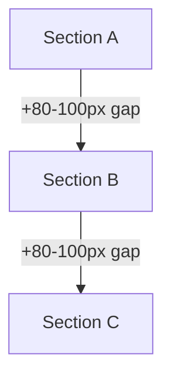
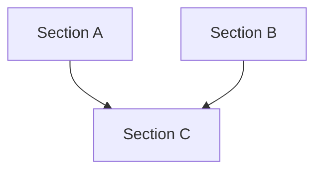

# MaxMCP Patch Creation Guidelines

This skill provides comprehensive guidelines for creating well-organized, maintainable Max/MSP patches using MaxMCP's MCP tools.

## Pre-Creation Checklist

Before creating a patch, verify:

1. **MaxMCP Connection**: Ensure maxmcp agent is running and connected
2. **Target Patch**: Use `get_frontmost_patch` or `list_active_patches` to identify the target
3. **Existing Objects**: Use `get_objects_in_patch` to understand current state
4. **Layout Planning**: Plan object positions before creation

## Core Principles

### 1. Signal Flow Direction

Always follow the **top-to-bottom, left-to-right** signal flow convention:



### 2. Object Placement Strategy

Use `get_avoid_rect_position` to find safe positions that don't overlap existing objects:

```javascript
// Before adding an object, find a safe (non-overlapping) position.
// With near_x/near_y it returns the nearest free spot to that point;
// without them it places to the right of existing objects.
// Returns { position: [x, y], width, height, rationale }.
const result = await mcp.get_avoid_rect_position({
  patch_id: "...",
  near_x: 100,   // optional target point
  near_y: 200,
  width: 80,
  height: 20
});
```

### 3. Grid-Based Layout

Align objects to a consistent grid:
- **Horizontal spacing**: 100-120 pixels between columns
- **Vertical spacing**: 40-60 pixels between rows
- **Section gaps**: 80-100 pixels between logical sections

**整列・分配・nub 合わせは手計算しない**。座標を暗算するのではなく、専用ツールに任せる（いずれも読み取り専用で推奨 `patching_rect` を返すだけなので、`set_object_attribute` で適用する）:

| やりたいこと | 使うツール |
|---|---|
| 複数オブジェクトの端／中心を揃える、間隔を均等化する | `align_objects`（`align_left`/`align_hcenter`/`distribute_v` など） |
| パッチコードが垂直一直線になるよう片方の幅・位置を決める | `suggest_alignment`（anchor の nub に target の nub を合わせる） |
| inlet/outlet の実ピクセル位置を知る | `get_io_position`（Max の等間隔ルールで nub 中心を算出） |

これらは Max の nub 配置（端インセット・等間隔）をサーバ側の実寸で計算するため、手計算より速く正確。詳細は `organize-patch` スキル参照。

### 4. Section Organization

Group related objects into functional sections:
- **Input section**: Top area for external inputs (adc~, midiin, etc.)
- **Processing section**: Middle area for signal processing
- **Control section**: Parameters, UI elements
- **Output section**: Bottom area for outputs (dac~, midiout, etc.)

## Patching Workflow

パッチはセクション単位で段階的に構築する。全体を一度に作らず、**5フェーズ**で進める。

### Phase 0: 設計（スキルのルールを設計制約として適用）

実装を開始する前に、スキルのルールをプランの設計制約として組み込む。

**⚠ Phase 0 を飛ばした場合**: 設計段階でルールを適用しないと、実装後に trigger の outlet 順序の間違い、UI オブジェクトの配置ミス（patching_rect で UI 優先配置 → 長距離・上向き接続の大量発生）、_parameter_order の依存チェーン不整合などが発覚し、パッチ全体の再構築が必要になる。

1. **信号フロー設計**: 全セクションの依存関係を描き、上→下フローを確保
   - patching_rect は接続構造優先で配置する（[Presentation Layout](reference/presentation-layout.md) の Dual-Mode Design 参照）
   - UI オブジェクトは処理チェーンの近くに配置（presentation_rect で見た目は別途制御）
2. **接続設計**: trigger の outlet 順序と下流の hot/cold inlet の整合性を設計
   - [Execution Model](reference/execution-and-messaging.md) の Connection Design Flow に従う
   - `pack` / `pak` に接続する trigger は、cold inlet → 右 outlet、hot inlet → 左 outlet
3. **パラメータ復元順序設計**: `_parameter_order` を復元依存チェーン全体で設計
   - cold inlet に接続するパラメータ → 小さい order（先に復元）
   - hot inlet に接続するパラメータ → 大きい order（後に復元 → 発火）
   - `_parameter_range` を設定するチェーン → 範囲内で値を復元するパラメータより先
4. **アトリビュート計画**: 各オブジェクトに必要なアトリビュートを [MCP Notes](reference/mcp-notes.md) のテンプレートで事前に列挙

5. **関連スキルの参照**: 作業内容に応じて以下のスキルをロードし、設計制約として適用する

   | スキル | 条件 | 参照すべきルール |
   |---|---|---|
   | `m4l-techniques` | M4L デバイス開発時（常時） | live.observer パターン、pattr 永続化、namespace ルール、_parameter_order 設計 |
   | `max-techniques` | poly~, pattr, signal 処理等 | pattr range 制限、cascading init |
   | `max-resources` | オブジェクトの outlet/inlet 構造が不明な時 | リファレンスページで確認してから設計 |

**Why Phase 0 が必要**: プランが承認された後にルールを適用しても、設計自体が間違っていれば大量の手戻りが発生する。

### Phase 1: セクション開発（各セクションのサイズ確定）

**前提条件**: Phase 0 の設計が完了していること（信号フロー設計、接続設計、_parameter_order 設計、アトリビュート計画）。

各セクションを独立して完成させる。セクション間の接続はこのフェーズでは行わない。

**⚠ セクション単位を飛ばして全体を一括構築した場合**: Phase 8 検証（重複・交差・上向き検出）で全オブジェクト・全パッチコードを対象に確認が必要になる。セクション単位であれば検証対象はセクション内のオブジェクトのみで済むが、一括構築では変更のたびにパッチ全体の大量のオブジェクトを再確認することになり、トークン消費と作業量が爆発する。

1. **セクションを計画**: パッチ全体を機能セクション（Input, Processing, Output 等）に分割
2. **1セクションずつ構築**:
   - 🔴 **そのセクションで使う LOM/特殊オブジェクトの reference を `Read` で先に取得**（m4l-techniques の MUST 参照ルール）。会話履歴が長くても、各セクション開始時に必ず再 Read する
   - オブジェクト追加（Operation Checklists の「add_max_object の後」を実行）
   - セクション内接続（Operation Checklists の「connect_max_objects の前」を実行）
   - `organize-patch`（セクション内モード）でレイアウト整理
   - **Phase 8 検証を実行**（`validate_layout` で上向き接続・オブジェクト重複・パッチコード交差を機械判定 → `error` を解消）
   - **セクションのサイズ（幅・高さ）が確定する**
3. **次のセクションへ**: 現セクションが確定してから次に着手

このフェーズ完了時点で、各セクションは内部レイアウトが完成し、サイズが固定される。

### Phase 2: セクション配置（セクション間の位置最適化）

**前提条件**:
- □ Phase 1 で全セクションの内部レイアウトが確定しているか？
- □ 各セクションで `validate_layout` を実行し、`error` を解消したか（残る `upward` warning は整形・記録済みの意図的区間のみ）？
→ 未完了なら Phase 2 に進まない

**⚠ Phase 1 未完了で Phase 2 に進んだ場合**: セクション単位でまとめておけばグループとして移動するだけで済むが、セクションが未確定だと個々のオブジェクトの座標を1つずつ計算・移動することになる。セクションは簡易なグループ化であり、これを飛ばすとレイアウト作業の複雑さが爆発する。

確定した各セクションを、セクション間接続を考慮して合理的な位置に配置する。

1. **接続計画**: どのセクションのどのオブジェクトが他セクションと接続するか把握
2. **配置パターン決定**: セクション間の依存関係に応じて直列・並列を選択
3. **セクション単位で移動**: 接続元と接続先が近くなるよう、セクションごとブロック移動
   - セクション内のオブジェクト間の相対位置は変えない
   - セクション間のギャップを維持（直列: 縦 80-100px、並列: 横 80-100px）
4. **接続経路の予測**: patchcord が合理的な経路を取れる位置関係になっているか確認

**配置パターン**:

**直列配置(順次依存):**



**並列配置(合流型依存):**



- **直列**: A → B → C のように順次依存する場合、縦に配置
- **並列**: A と B が独立して動作し、C が両方の結果を必要とする場合、A と B を横に並べて配置し、C を下に配置

### Phase 3: セクション間接続

**前提条件**:
- □ Phase 2 でセクション配置が確定しているか？
- □ 接続経路の予測で、patchcord が合理的な経路を取れる位置関係になっているか？
→ 未完了なら Phase 3 に進まない

**⚠ Phase 2 未完了で Phase 3 に進んだ場合**: セクション位置が確定していない状態で patchcord を接続すると、カオスなパッチコードが大量生産される。その状態でパッチコードの整理を試みても、より複雑なスパゲッティを生むだけで収束しない。

セクション配置が確定した後、セクション間の patchcord を接続する。

1. **セクション間接続を実行**: `connect_max_objects` でセクション間の patchcord を追加
2. **midpoints 設定**: 必要に応じて `set_patchline_midpoints` で経路を最適化
3. **最終検証**: `validate_layout`（Phase 8 検証）で重複・交差・上向きを機械判定し、`error` を解消

### Phase 4: 完成検証

**前提条件**:
- □ Phase 3 でセクション間接続が完了しているか？
- □ Phase 3 の最終検証で `validate_layout` を実行し、`error` を解消したか？
→ 未完了なら Phase 4 に進まない

**⚠ Phase 4 を飛ばした場合**: 生成時のチェックリスト（add_max_object の後）は個々のオブジェクトを対象とするため、パッチ全体での一貫性（ペア間の設定整合、_parameter_order の依存チェーン整合）は検出できない。これらの問題はユーザーが実際に保存・復元を試すまで発覚せず、原因の特定が極めて困難になる。

パッチ全体を対象とした一括検証を行う。

#### 4-1. パラメータ設定の一括検証

全 live.* UI オブジェクトと全 pattr の設定を `get_object_attribute` で読み戻し、以下を確認:

**live.* UI オブジェクト**:
- `_parameter_initial_enable` が 1 か
- `_parameter_initial` が設定されているか
- `_parameter_type` と `_parameter_unitstyle` の整合性（Float(0) → Float(1)）

**pattr**:
- `parameter_enable 1`, `_parameter_invisible 1`, `_parameter_modmode 0`, `parameter_mappable 0` が設定されているか
- `_parameter_initial_enable` が 1 か
- `_parameter_range` がデータ型に応じた適切な範囲か

#### 4-2. ペア/グループ整合性チェック

対になるオブジェクト、同一グループのオブジェクトが同じ設定パターンを持つか確認:

- **min/max ペア**: `_parameter_type`, `_parameter_unitstyle`, `_parameter_initial_enable`, `_parameter_range` が一致するか
- **pattr グループ**: `parameter_enable`, `_parameter_invisible`, `_parameter_modmode`, `parameter_mappable` が同じパターンか
- **設定の非対称を検出した場合**: 意図的な差異でない限り、設定漏れとして修正

#### 4-3. `_parameter_order` の読み戻し検証

全パラメータの `_parameter_order` を `get_object_attribute` で読み戻し、以下を検証:

1. **order の連番確認**: 抜け・重複がないか
2. **依存チェーンとの照合**:
   - cold inlet に接続するパラメータが、同じオブジェクトの hot inlet に接続するパラメータより小さい order を持つか
   - `_parameter_range` を設定するチェーン（pattr → pack → prepend → UI）が、範囲内で値を復元する UI オブジェクトより先か
   - `scale` / `pak` / `pack` 等の複数 inlet オブジェクトで、hot inlet (0) に接続するパラメータが最後に復元されるか
3. **問題を検出した場合**: order を修正し、再度読み戻して確認

#### 4-4. レイアウト最終検証（Phase 8）

パッチ全体を対象に `validate_layout({patch_id})` を実行し、`error`（上向き接続・オブジェクト重複・パッチコードとオブジェクトの交差）を全て解消する。残る `upward` warning は U 字に整形済み＋ comment で記録された意図的区間のみ許容する（[Phase 8 検証](#レイアウト変更の後phase-8-検証) の完了条件に従う）。`presentation` を使うパッチは `mode: "presentation"` でも実行する。

（Phase 1 の各セクションで実施済みの検証を、パッチ全体で再度実行）

### Phase 5: 実信号検証（Empirical Verification）

**前提条件**:
- □ Phase 4 完成検証完了
- □ 全パラメータ・接続の構造的検証完了
→ 未完了なら Phase 5 に進まない

**⚠ Phase 5 を飛ばした場合**: 構造的に正しくても **初期化トリガ漏れ** や **応答フォーマット推測ミス** で動作しないパッチが「完成」として報告される。典型例:
- `live.path` を `live.observer` に直結したが load 時に発火せず、observer が永久に沈黙
- `live.observer` の出力形式を推測して `route` 設計したが、実形式が異なり全分岐に該当せず黙って消える
- `pattr` (autorestore=0) で初期値が入らず、依存する UI が初期表示できない

これらは構造検査では検出不可能で、ユーザーが Live にロードして初めて発覚する。原因特定に膨大な時間を要する。

#### 5-1. 初期化チェーンの存在確認

`get_objects_in_patch` で以下のオブジェクトの存在を確認し、各々に起動経路があるかチェック:

| オブジェクト | 起動経路に必須なもの |
|---|---|
| `live.path` | `loadbang` / `live.thisdevice` / sel outlet bang のいずれか |
| `live.observer` | inlet 1 への id 供給 + inlet 0 への property 設定の両方 |
| `live.thisdevice` | （自身が起点なので不要、ただし下流チェーンが繋がっているか確認） |
| `pattr` (autorestore=0) | 明示的な復元バン |
| `loadmess` / `loadbang` | 出力先が処理開始の起点になっているか |

不足していれば Phase 0 設計に戻し、起動経路を追加してから Phase 5 を再実行。

#### 5-2. プローブによる出力形式実証確認

**データ形式が「reference に明記されていない」または「推測に基づく」箇所には必ず `print` プローブを一時挿入する**。

挿入対象:
- `live.observer` outlet 0 直後（property 値の実フォーマット確認）
- `live.object` outlet 0 直後（get 応答の実フォーマット確認）
- 複雑な `route` の前後（分岐が意図通りか）
- `zl.ecils` / `unpack` 等の list 操作後

検証手順:
1. `add_max_object` で `print <varname>_probe` を挿入し、対象 outlet と接続
2. **ユーザーに実機トリガを依頼**（「Learn ボタンを押してください」「Live のパラメータを動かしてください」等）
3. `get_console_log` で実出力を取得
4. 取得形式が下流の `route` / `unpack` 設計と一致するか照合
5. 不一致なら Phase 0 設計を修正して再構築
6. 検証完了後、プローブを削除（または `comment` に確認済み形式をメモ）

#### 5-3. 検証結果のドキュメント化

確認した出力形式・トリガ仕様を `comment` オブジェクトでパッチ内に記録:

```
// observer (selected_parameter) outputs: "id N" (id 0 = no selection, verified 2026-05-08)
// route id passes N. sel 0 filters zero.
// live.path needs bang from t_capture to refire on each Learn enable.
```

これにより次回の作業時（または別の Claude セッション）で再推測が不要になる。

#### Phase 5 完了基準

- [ ] 5-1 の起動経路チェック全項目クリア
- [ ] 5-2 で推測に基づいていた出力形式を全て `print` で実証確認
- [ ] 5-3 でパッチ内に動作仕様を comment で残した
- [ ] プローブを全て削除（または無効化）

### Why This Order Matters

- Phase 0 で設計制約を組み込むため、実装段階での手戻りが最小化される
- Phase 1 でセクションサイズが確定するため、Phase 2 で正確な配置計算ができる
- Phase 2 でセクション位置が確定するため、Phase 3 で patchcord 経路が安定する
- Phase 4 でパッチ全体の構造的一貫性を検証するため、設定漏れや順序ずれが出荷前に検出される
- **Phase 5 でデータが実際に流れることを実証するため、初期化漏れや形式推測ミスが Live ロード前に検出される**
- 後フェーズでの手戻りが最小化される

## Operation Checklists

各 MCP 操作の前後に実行すべき確認事項。スキルの原則を操作レベルで適用するためのチェックリスト。

### add_max_object の前（事前ルール）

**🔴 obj_type には省略形を渡す（[Object Text Conventions](reference/object-text-conventions.md) Section 1）**:

| 違反 | 正解 |
|---|---|
| `obj_type="trigger"` | `obj_type="t"` |
| `obj_type="select"` | `obj_type="sel"` |
| `obj_type="bangbang"` | `obj_type="b"` |
| `obj_type="int"` | `obj_type="i"` |
| `obj_type="float"` | `obj_type="f"` |
| `obj_type="send"` | `obj_type="s"` |
| `obj_type="receive"` | `obj_type="r"` |

**🔴 `obj_type="message"` は固定値で使わない**:
固定値は `obj_type="t"` / `prepend` / `zl.reg` のいずれかを使う。判定は [Execution Model & Messaging](reference/execution-and-messaging.md) 冒頭の Decision Tree に従う。

**🔴 Float コンテキストでは引数を Float リテラルに**:
- `pak`, `pack`, `scale`, `+`, `-`, `*`, `/`, `pow`, `expr`, `change` 等で Float を扱う場合、引数 `[0., 0.]` のように `.` を必ず付ける
- 違反例: `obj_type="pak", arguments=[0, 0]` → text が `"pak 0 0"` になり Int モード化

### add_max_object の後

**⚠ このチェックリストを飛ばした場合**: 後工程での修正以前に、設定し忘れによるバグが大量発生する。パラメータ名がデフォルト（"live.numbox[1]"）のまま、presentation が 1 のまま、_parameter_initial_enable が 0 のまま等、原因特定に膨大な時間と労力を費やすのは Claude 自身。生成直後に確認すれば数秒で済む作業を、後から探すと何倍もかかる。

1. `get_objects_in_patch` でオブジェクトのテキストを確認し、以下を機械的に検証:
   - `@` 構文のアトリビュートが反映されているか
   - **text に `trigger ` / `select ` / `bangbang` / `bangbang ` / 単独の `int ` / 単独の `float ` / `send ` / `receive ` が含まれていないか** → 含まれていれば `replace_object_text` で省略形に修正（例: `trigger b b b b l` → `t b b b b l`）
   - **maxclass が `message` のオブジェクトが新規追加されていないか** → 追加されている場合、固定値か動的構築か判定:
     - 固定値の場合: [Execution Model & Messaging](reference/execution-and-messaging.md) 冒頭の Decision Tree に従って `t` / `prepend` / `zl.reg` に置換（`remove_max_object` + `add_max_object` で再構築）
     - 動的構築（ユーザー入力をそのまま流す等）の場合: 容認するが、その理由を `comment` で残す
   - **Float コンテキストの `pak 0 0` / `pack 0 0` / `scale 0 1 ...` のような Int モード引数がないか** → あれば `replace_object_text` で `pak 0. 0.` 等に修正
   - **pattr の場合、第一引数で varname が強制上書きされていないか** → `pattr <name>` で生成すると varname が `<name>` になる。後続の `set_object_attribute` は実 varname を使う必要がある
2. ロジック用オブジェクト（trigger, prepend, route, zl, gate, live.object, live.path, pattr, pack, scale 等）は `set_object_attribute` で `presentation 0` を設定
3. live.* UI オブジェクトの場合:
   - `_parameter_longname` を varname に合わせて設定
   - `_parameter_initial_enable 1` を設定
   - `_parameter_initial` を設定
   - `get_object_attribute` で `_parameter_type`, `_parameter_unitstyle`, `_parameter_range` が意図通りか確認
4. live.text の場合: `text` / `texton` ラベルを設定
5. live.comment の場合: `replace_object_text` でテキストを設定
6. pattr の場合:
   - `parameter_enable 1`, `_parameter_invisible 1`, `_parameter_modmode 0`, `parameter_mappable 0` を設定
   - `_parameter_range` をデータに応じた範囲に設定（Float: `[-100000, 100000]` 等）
   - `_parameter_type` をデータ型に応じて設定（Float: 0, blob: 3 等）
   - `_parameter_initial_enable 1` を設定
   - **pattr は第一引数で varname が強制上書きされる**: `add_max_object` の戻り値の varname を確認してから後続操作を実施（例: `pattr param_min` を作ると `varname=param_min` になる、リクエストした varname は破棄される）

7. **LOM 系オブジェクト（live.path / live.object / live.observer / live.thisdevice）の場合**:
   - 🔴 [m4l-techniques の MUST 参照ルール](../m4l-techniques/SKILL.md) に従い、関連 reference を **Read で先に取得** してから接続設計に入る
   - `live.path` / `live.observer` を追加した場合、起動トリガ経路（loadbang / live.thisdevice / sel bang 等）が Phase 0 設計に含まれているか即座に確認。なければ Phase 0 に戻る
   - 出力フォーマットが reference に明記されていない property を扱う場合、**`print <varname>_probe` を同時に追加し、Phase 5 で実機確認する旨をメモ**
   - 自デバイスのパラメータ操作を伴う場合（Learn 系）、`live.thisdevice` + `canonical_parent` フィルタ計画があるか Phase 0 設計と照合

### connect_max_objects の前

**⚠ このチェックリストを飛ばした場合**: outlet/inlet の役割を推測で接続し、動作しない接続を作成する。ユーザーに指摘されて切断→リファレンス確認→再接続のサイクルが発生し、1回の確認で済む作業が3回以上のやり取りになる。trigger の outlet 順序を間違えると、hot/cold の実行順序が逆転し、値が格納される前に pack が発火する等のロジック不具合が発生する。

1. `get_object_io_info` で接続元の outlet 数と接続先の inlet 数を確認
2. 接続先の inlet が hot (左) か cold (その他) かを確認（[Execution Model](reference/execution-and-messaging.md) 参照）
3. `trigger` から接続する場合:
   - 右→左の実行順序を確認
   - cold inlet に接続する値を右側 outlet に配置（先に発火 → 格納）
   - hot inlet に接続する値を左側 outlet に配置（最後に発火 → 処理開始）
4. `pattr` から接続する場合:
   - outlet 0 (左) = 値出力、outlet 1 (中央) = bindto（UIバインド）、outlet 2 (右) = dumpout
   - 値を下流に送る場合は outlet 0、UI にバインドする場合は outlet 1
5. **outlet/inlet の役割が不明なオブジェクトは、推測で接続せず `max-resources` スキルでリファレンスを必ず確認する**。推測による接続は手戻りの最大の原因となる

### レイアウト変更の後（Phase 8 検証）

**⚠ この検証を飛ばした／手計算で代替した場合**: 上向き接続、オブジェクト重複、パッチコードとオブジェクトの交差がユーザーの目視確認まで検出されない。さらに **`get_objects_in_patch` / `get_patchlines` の座標を読んで矩形交差を暗算するのは禁止**——手計算は実レンダリング寸法を反映できず誤判定する。実例: `comment` の実高さは指定した 20px ではなく約 33px（フォント分だけ背が高い）になり、下端が想定外まで伸びて隣接オブジェクトと数 px 重なる。「高さ＝指定値」を前提にした暗算ではこの種の重なりを構造的に見逃す。これらは `validate_layout` がサーバ側の実寸で機械判定する種類の問題である。

一連のレイアウト操作が完了した後に**必ず `validate_layout` を呼ぶ**。これがこのプロジェクトのレイアウト検証の唯一の正規手段であり、Phase 8 検証そのものである。

1. `validate_layout({patch_id})` を呼ぶ（セクション内検証は `scope_varnames` に対象 varname を渡して範囲限定）
2. `findings` を `type` と `severity` に応じて修正する:
   - **`upward`（上向き接続）**: `severity: error`（ミッドポイント無しの直線上向き）は事故とみなし、オブジェクト移動で解消するか U 字ミッドポイントで外側レーンへ逃がす。`severity: warning`（ミッドポイント付き）は迂回意図ありの区間なので、意図通りか確認する
   - **`overlap`（オブジェクト重複）**: いずれかを移動／リサイズして分離
   - **`cord_object`（パッチコードがオブジェクトを横切る）**: 横切られたオブジェクトを移動（優先）またはミッドポイントで迂回
   - **`cord_cord`（パッチコード同士の重複）**: 一方のミッドポイントを 5px 以上ずらす
3. `validate_layout` を再実行し、**`error` を全て解消するまでループ**する。`presentation` を使うパッチは `validate_layout({patch_id, mode: "presentation"})` も実行する（presentation_rect の重複のみ判定、パッチコード関連はスキップ）

**完了条件**: `clean: true` を目指す。ただし下記の「意図的な上向き接続」は例外で、整形・記録済みであれば残ってよい。

#### 意図的な上向き接続（フィードバックループ等）

目的は「上向きをゼロにする」ことではなく「**事故の上向きを無くし、意図的な上向きはそれと分かる形に整える**」こと。フィードバックループのように構造上どうしても上向きになる接続は、以下のように扱う:

1. **U 字ミッドポイント（4 点）で外側レーンを通す**。直線の事故上向き（`error`）と視覚的に区別でき、`validate_layout` 上も `warning` に落ちる。経路の作り方は [Layout Rules](reference/layout-rules.md) の「Pattern 2: U-Shape (4 midpoints)」に従う:
   - アウトレットの **10〜17px 下** に 1 点（`source_y + 10~17`）
   - インレットの **11〜15px 上** に 1 点（`dest_y - 11~15`）
   - 残り 2 点で外側レーン（負の X、または最右オブジェクト +20px）を上下に通す
   - インレット/アウトレットのすぐ隣に 2 点だけ置くと見づらいので、**必ずこの上下クリアランスを含む 4 点**にする
2. **近くに `comment` で意図を明記**する（例: `// feedback: filt_out → delay_in（意図的）`）。次回セッションで誤って「直す対象」と判定されるのを防ぐ
3. これらを満たした `warning` は解消対象から外す。Phase 8 の完了条件は「**`error` を全て解消し、残る `upward` warning は U 字に整形済み＋ comment で記録された意図的な区間だけ**」である

> 補足（レイアウト外の注意）: MSP の音声フィードバックはレイアウト以前に、1 サンプル遅延（`tapin~`/`tapout~`、`send~`/`receive~`、`gen~` 等）を挟まないと Max がループを切る／エラーになる。信号設計面は `max-techniques`（feedback loop prevention）を参照する。

### _parameter_order の設計

**⚠ 依存チェーンを考慮せず個別に order を設定した場合**: pack だけでなく、多くのオブジェクトの cold inlet に必要な値が代入されないままオブジェクトが動作（誤動作）する。メッセージの順序に起因するバグは原因が非常に分かりづらく、特定と修正に膨大な時間と労力を費やすことになる。_parameter_range が設定される前に値を復元すると、デフォルト範囲 [0, 127] でクランプされ、保存した値が失われる。

パラメータを設定する前に、復元依存チェーン全体を設計する:

1. `pack` / `pak` の hot/cold inlet 構造を特定
2. `scale` 等の複数 inlet オブジェクトで、hot inlet (0) と cold inlet の依存関係を特定
3. cold inlet に接続するパラメータに小さい order を割り当て（先に復元 → 格納）
4. hot inlet に接続するパラメータに大きい order を割り当て（後に復元 → 発火）
5. `_parameter_range` を設定するチェーンを先に復元
6. 独立パラメータは最後の order に配置
7. **設定後の読み戻し検証**: 全パラメータの `_parameter_order` を `get_object_attribute` で読み戻し、依存チェーンとの整合性を確認。Phase 4（完成検証）でも再検証する

## Object Creation Best Practices

### Varname Conventions

Always provide meaningful varnames for important objects:

```javascript
await mcp.add_max_object({
  patch_id: "...",
  obj_type: "cycle~",
  arguments: [440],     // JSON array; elements are bare numbers/strings
  varname: "osc_main",  // Meaningful, descriptive name
  position: [100, 200]
});
```

**Naming patterns**:
- `osc_*` for oscillators
- `filt_*` for filters
- `env_*` for envelopes
- `gain_*` for gain controls
- `ctrl_*` for UI controls
- `in_*` / `out_*` for I/O

### Connection Guidelines

Connect objects using their varnames:

```javascript
await mcp.connect_max_objects({
  patch_id: "...",
  src_varname: "osc_main",
  outlet: 0,
  dst_varname: "gain_master",
  inlet: 0
});
```

**Connection rules**:
- Connect signal outlets (0) to signal inlets
- Verify inlet/outlet indices before connecting
- Use `get_patch_info` to check object connections

## Common Patterns

### Audio Signal Chain

```
cycle~ → *~ → dac~
```

1. Create oscillator at top
2. Create gain control (*~) below
3. Create dac~ at bottom
4. Connect in order

### MIDI Processing

```
midiin → midiparse → [processing] → noteout
```

### Subpatcher Organization

For complex patches, use subpatchers (p object):
- Group related functionality
- Use send/receive for communication
- Document inputs/outputs

## Reference Documentation

### Execution Model & Messaging Patterns (MUST READ)

Max の実行モデル（hot/cold inlet）と安全なメッセージ出力パターン。全てのパッチ作業の前提知識。

**Key topics**:
- Hot (leftmost) vs cold (other) inlets — Max の基本実行モデル
- Why `trigger` outputs right-to-left
- `pack` vs `pak` (controlled vs any-inlet triggering)
- Avoiding `message` boxes — use `trigger`, `prepend`, `append` instead
- `trigger` as the safest constant parameter source
- `zl.reg` for safe list storage, `pack` / `pak` for list construction

See [Execution Model & Messaging Reference](reference/execution-and-messaging.md)

### Object Text Conventions (MUST READ)

オブジェクトテキストの記述規則と効率的なコーディングパターン。

**Key topics**:
- Use abbreviations (`trigger` → `t`, `int` → `i`, etc.)
- Explicit type via arguments (`scale 0. 1.` not `scale 0 1`)
- `scale` exponent argument for integrated curve mapping (replacing `pow` + `scale`)
- Multiplication filter pattern (`*`) as a compact alternative to `gate + i`

See [Object Text Conventions Reference](reference/object-text-conventions.md)

### Layout & Visual Design

- [Layout Rules](reference/layout-rules.md) - Detailed positioning and spacing rules
- [MCP Notes](reference/mcp-notes.md) - MCP tool-specific notes (attribute setting, presentation workarounds)
- [Naming Conventions](reference/naming-conventions.md) - Varname and object naming standards
- [Presentation Layout](reference/presentation-layout.md) - Dual-mode design: patching vs presentation positioning
- [Visual Design](reference/visual-design.md) - Panel backgrounds, color palettes, border styling
- [JavaScript Guide](reference/javascript-guide.md) - v8/v8ui scripting recommendations

## MCP Tools Quick Reference

| Tool | Purpose |
|------|---------|
| `list_active_patches` | List registered patches |
| `get_frontmost_patch` | Get currently focused patch |
| `get_objects_in_patch` | List objects in a patch (use `mode: "layout"` for position/size only, `mode: "identity"` for naming/inspection — reduces token usage) |
| `get_patch_info` | Get patch metadata |
| `add_max_object` | Create a new object |
| `set_object_attribute` | Modify object properties |
| `get_object_value` | Get current value (number, slider, etc.) |
| `connect_max_objects` | Create patchcord |
| `disconnect_max_objects` | Remove patchcord |
| `get_patchlines` | List all patchcords (use `mode: "geometry"` for layout work without color/hidden, `mode: "connections"` for topology-only when inspecting an existing patch — reduces token usage) |
| `set_patchline_midpoints` | Add/remove midpoints to fold patchcords |
| `remove_max_object` | Delete an object |
| `get_avoid_rect_position` | Find safe position |
| `validate_layout` | Phase 8 検証: 重複・交差・上向き・presentation 重複を実寸で機械判定（手計算の代替。`error` を `clean` まで解消） |
| `align_objects` | 複数オブジェクトの端／中心揃え・間隔均等化の `patching_rect` を算出（手計算の代替） |
| `suggest_alignment` | パッチコードが垂直一直線になる `patching_rect` を算出（nub 合わせの代替） |
| `get_io_position` | inlet/outlet の実ピクセル中心を算出（nub x の手計算の代替） |
| `get_console_log` | Retrieve Max console messages |
