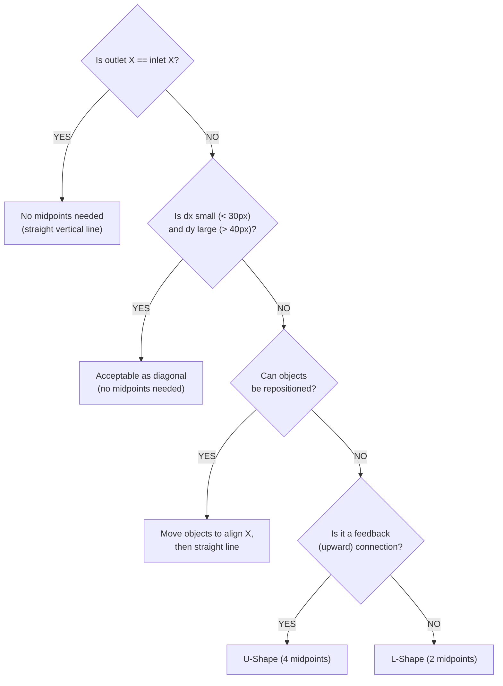

# Layout Rules for Max/MSP Patches

Detailed positioning and spacing guidelines for creating organized, readable patches.

## Fundamental Principle: Layout Operations Are Non-Destructive

Object repositioning (`patching_rect`), object resizing, and midpoint addition/removal are **purely visual operations** that never affect patch logic. Patchcord connections, object arguments, and signal flow remain intact regardless of layout changes.

**Do not hesitate to adjust layout proactively.** Move objects, resize them, and add midpoints freely to achieve clean, readable patches. There is no risk of breaking functionality.

### Patching Mode Size Is for Patchcords, Not UI

Object size and position in patching mode should prioritize **patchcord alignment** (straight lines, no crossings). Visual readability for end users (text fits the box, comfortable interaction size) is the job of **presentation mode** (`presentation_rect`).

Max provides two independent coordinate systems:
- `patching_rect` — optimized for connection structure
- `presentation_rect` — optimized for user interaction (see [Presentation Layout](presentation-layout.md))

```
textedit: patching mode → minimum width for inlet/outlet alignment
          presentation mode → wider for readable text display

live.dial: patching mode → intrinsic size (cannot change)
           presentation mode → position adjustment only
```

## Grid System

### Base Grid

Use a consistent grid for all object placement:

- **Grid unit**: 20 pixels
- **Object alignment**: Snap to grid for consistency
- **Minimum spacing**: 1 grid unit (20px) between objects

### Standard Positions

```
Column 1: x = 50
Column 2: x = 170
Column 3: x = 290
Column 4: x = 410

Row 1: y = 50
Row 2: y = 100
Row 3: y = 150
...
```

## Object Dimensions

### Standard Object Sizes

| Object Type | Typical Width | Height |
|-------------|---------------|--------|
| Basic object (button, toggle) | 20-30 | 20 |
| Text object (message, number) | 50-100 | 20 |
| Signal object (cycle~, *~) | 60-80 | 20 |
| UI object (slider, dial) | 30-50 | 80-140 |
| Subpatcher (p, bpatcher) | 100-200 | 60-100 |
| Comment | Variable | 20 |

### Width Calculation

For objects with arguments, estimate width:
- Base width: 40px
- Per character in arguments: ~7px
- Example: `cycle~ 440` ≈ 40 + (10 × 7) = 110px

## Spacing Guidelines

### Horizontal Spacing

- **Between columns**: 100-120px (center to center)
- **Parallel paths**: 100px minimum
- **Related objects**: 80px
- **Signal chains**: 100px

### Vertical Spacing

- **Between rows**: 40-60px
- **After comments**: 30px
- **Section breaks**: 80-100px
- **Before/after subpatchers**: 60px

### Minimum Spacing

- **Between objects**: 10px minimum (both horizontal and vertical). Closer spacing makes patchcord connections hard to follow
- **L-shape routing gap**: 20px minimum between objects where an L-shape midpoint's horizontal segment passes through. This ensures 10px clearance above and below the horizontal segment
- **Section header comment**: 15px above the topmost object in the section

## Section Organization

### Standard Patch Layout

```
┌─────────────────────────────────────────┐
│  INPUTS & PARAMETERS (y: 50-150)        │
│  ├── Audio inputs (adc~)                │
│  ├── MIDI inputs (midiin)               │
│  └── User controls (sliders, dials)     │
├─────────────────────────────────────────┤
│  PROCESSING (y: 200-400)                │
│  ├── Signal processing                  │
│  ├── MIDI processing                    │
│  └── Logic/routing                      │
├─────────────────────────────────────────┤
│  MODULATION & CONTROL (y: 450-550)      │
│  ├── LFOs, envelopes                    │
│  └── Automation                         │
├─────────────────────────────────────────┤
│  OUTPUTS (y: 600-700)                   │
│  ├── Audio outputs (dac~)               │
│  ├── MIDI outputs (midiout)             │
│  └── Displays (scope~, meter~)          │
└─────────────────────────────────────────┘
```

## Main Flow Alignment

### Identifying the Main Flow

Every patch has a **primary processing chain** — the path with the most processing steps from input to output. This chain should be the vertical backbone of the patch layout.

**Selection criteria**: Choose the path that passes through the most objects as the main flow. Secondary inputs (shorter paths) are allowed to connect diagonally.

**Example — Float addition patch**:
```
input_left (x=272)    input_right (x=325)
                           │
                      trig_right (x=325)    ← trigger splits into bang + float
                        │       │
                        ↓       ↓
          input_left ─→ + 0. (x=325)        ← input_left connects diagonally
                           │
                        result (x=325)
```

- **Main flow**: `input_right` → `trig_right` → `+ 0.` → `result` (3 connections, 4 objects)
- **Secondary input**: `input_left` → `+ 0.` (1 connection, diagonal — acceptable)

### Aligning the Primary Chain

Once the main flow is identified, align all objects in the chain to the **same X coordinate** so that patchcords flow as vertical straight lines:

1. Choose the X position of the topmost object in the chain as the reference
2. Move all downstream objects in the chain to the same X
3. Adjust object widths so that multi-outlet/inlet connections within the chain also align vertically (see [Width Adjustment](#width-adjustment-for-straight-lines) below)

**Result**: The main flow forms a clear vertical column. Secondary inputs approach diagonally, which is acceptable under the [Diagonal Line Tolerance](#diagonal-line-tolerance) rules.

## Patchcord Management

### No Upward Patchcords

Patchcords must always flow **top to bottom**. Upward (downstream-to-upstream) patchcords are prohibited — they make signal flow extremely difficult to trace.

**How to fix upward connections**:
1. Move downstream objects further down so the connection flows downward
2. If that's difficult, move upstream objects higher, then shift everything down
3. `send`/`receive` is a last resort (increases CPU, hides signal path)

**Exception**: Feedback loops that are structurally unavoidable. Route these using U-shape midpoints along the patch exterior so they don't cross other objects.

### Principle: Vertical Straight Lines First

The most readable patches keep patchcords as **vertical straight lines**. Achieve this by aligning the source outlet and destination inlet on the same X coordinate.

**Example**:
```
live.button (x=18)     trigger (x=18)
  outlet (x=27.5)       inlet (x=27.5)   ← same X = straight line
       │
       ↓  (vertical, no midpoints needed)
```

**Rule**: Before adding midpoints, first try repositioning objects so that outlet and inlet share the same X coordinate.

### Width Adjustment for Straight Lines

When two objects have multiple inlets/outlets connected (e.g., `filtercoeff~` → `biquad~`), adjust **object width** via `patching_rect` so that outlet and inlet X coordinates align, eliminating diagonal patchcords.

**Priority**: Align the **rightmost connected inlet** first, then adjust the source object's width to match.

```
filtercoeff~  (width adjusted to align rightmost outlet with biquad~'s rightmost inlet)
  │  │  │  │  │
  ↓  ↓  ↓  ↓  ↓   ← all vertical straight lines
biquad~
```

#### Matching Widths in the Main Flow

When objects in the main flow chain have different default widths, adjust their widths to match. This ensures that **all outlets and inlets at the same index** align vertically throughout the chain.

**Example**: `t b f` (default width ~30) connected to `+ 0.` (default width ~30):
```
Before (default widths):          After (matched widths):

  t b f (w=30)                      t b f (w=56)
   │  ╲                              │    │
   ↓    ╲  ← diagonal               ↓    ↓  ← both vertical
  + 0. (w=30)                       + 0. (w=56)
```

**Rule**: Set connected objects in the main flow to the **same width** so that corresponding outlet/inlet pairs share the same X coordinate.

#### Width Expansion to Bypass Intermediate Objects

When a vertical patchcord between two objects (e.g., `trigger` → `*`) passes through an intermediate object that is wider, expand the source and destination widths so the patchcord runs **outside** the intermediate object's right edge.

```
t b i (width=170) — outlet 1 at x=516.5
  ↓ vertical line (x=516.5)
  ↓ zl.reg get canonical_parent (width=155, right edge x=511) — passes outside
  ↓
* 0 (width=170) — inlet 1 at x=516.5
```

- Set `t b i` and `* 0` width to 170, placing outlet/inlet 1 at x=516.5
- The widest intermediate object (`zl.reg get canonical_parent`, right edge x=511) is 5.5px to the left
- The text content doesn't need 170px width, but the expansion is intentional for patchcord alignment

### Multi-Connection Alignment Rules

When multiple patchcords converge or diverge, align connected objects by Y coordinate.

#### Multiple Outlets → One Inlet

Place all source objects at the **same Y position**:

```
  objA (y=200)    objB (y=200)    objC (y=200)   ← same Y
    │                │                │
    └────────────────┼────────────────┘
                     ↓
                  dest (y=260)
```

#### One Outlet → Multiple Inlets

Place all destination objects at the **same Y position**:

```
                source (y=200)
                     │
            ┌────────┼────────┐
            ↓        ↓        ↓
  objA (y=260)  objB (y=260)  objC (y=260)   ← same Y
```

#### Multiple Outlets → Multiple Inlets

Place all source objects at the **same Y** and all destination objects at the **same Y**. Use **staggered horizontal lanes** (L-shape midpoints) to separate each source's non-direct connections at distinct Y levels:

```
  int1 (y=439)     int2 (y=439)     int3 (y=439)      ← sources: same Y
    │                 │                 │
    │ int1 lane ──────│─────────────────│── y=476
    │                 │ int2 lane ──────│── y=500
    │                 │                 │ int3 lane ── y=518
    ↓                 ↓                 ↓
    a (y=535)    b (y=535)    c (y=535)    d (y=535)    ← dests: same Y
```

**Rules**:
- Direct connections (same X for outlet and inlet) use **straight vertical lines** with no midpoints
- Non-direct connections use **L-shape midpoints** with a horizontal segment
- Each source gets a **unique horizontal lane Y** to prevent overlapping patchcords
- Lane Y values are staggered between source Y and destination Y (e.g., source_y+17, source_y+41, source_y+59 for 3 sources across a 76px gap)

**Example**:
```
int1→a: straight (same X=884.5)
int1→c: L-shape at y=476   ← int1's lane
int2→c: straight (same X=960.5)
int2→b: L-shape at y=502   ← int2's lane
int3→d: straight (same X=1010.5)
int3→a: L-shape at y=518   ← int3's lane
```

#### Route Demultiplexer (1:1 Mapping Variant)

When a single multi-outlet object (e.g., `route`) connects each outlet to a dedicated destination object, the layout simplifies to 1:1 vertical straight lines with equal horizontal spacing:

```
route 0 1 2 3 4 5 6 7 8 (x=369, y=616)
  │ │ │ │ │ │ │ │ │
  ↓ ↓ ↓ ↓ ↓ ↓ ↓ ↓ ↓     ← 9 outlets, all vertical straight lines
  t t t t t t t t t        ← trigger objects at same Y (y=649), ~24px spacing
```

**Rules**:
- All destination objects at the **same Y** (fan-out row)
- Equal horizontal spacing between destinations (~24px)
- Each outlet connects to exactly one inlet → all patchcords are **vertical straight lines** (no L-shape needed)
- Adjust `route` object width so that each outlet X aligns with the corresponding destination object's inlet X

### Midpoint Routing Patterns

Use `set_patchline_midpoints` to route patchcords around obstacles when straight lines are not possible.

#### Pattern 1: L-Shape (2 midpoints)

For redirecting a connection to an adjacent column without crossing objects:

```
Source outlet (x=97.5, y=476)
       │
       ↓
   M1 (97.5, 488) ──→ M2 (27.5, 488)
                            │
                            ↓
                   Dest inlet (27.5, 520)
```

**When to use**: One object's outlet needs to reach another column's inlet. Route horizontally at a consistent Y, then drop vertically.

```javascript
set_patchline_midpoints({
  midpoints: [
    { x: 97.5, y: 488 },   // horizontal from source
    { x: 27.5, y: 488 }    // turn corner toward dest
  ]
})
```

**Spacing rule**: Place the horizontal segment at least 10px below the source outlet. The minimum gap is ~12px (`source_y + 12`), but in practice the Y position varies based on routing context — median ~50px in production patches. Use a closer gap (10-20px) for short hops and a larger gap when routing around obstacles.

**Destination-Near variant**: When the connection spans a large vertical distance (> 500px), place the L-shape horizontal segment **near the destination** rather than near the source. This avoids an unnecessarily long diagonal approach.

```
adsr~ (x=46, y=496)
  │
  │  (long vertical run, ~900px)
  │
  M1 (56, 1406) ──→ M2 (656, 1406)    ← horizontal near dest
                          │
                          ↓
                    times~ (x=636, y=1430)   ← 24px below horizontal
```

Place the horizontal segment 20-30px above the destination inlet. When multiple long-distance connections share the same destination area, align their horizontal segments at the same Y for visual consistency.

#### Pattern 2: U-Shape (4 midpoints)

For feedback loops or long-distance return paths that must avoid crossing the main signal flow:

```
Source outlet (x=27.5, y=984)
       │
       ↓
   M1 (27.5, 1001) ──→ M2 (-1.5, 1001)
                            │
                            ↑  (travels upward outside patch)
                            │
                        M3 (-1.5, 509)
                            │
                            ↓
   M4 (49.5, 509)  ←──────┘
       │
       ↓
   Dest inlet (49.5, 520)
```

**When to use**: A feedback line must travel a long distance upward. Route **outside** the main patch area (negative X or far right) to keep the interior clean.

```javascript
set_patchline_midpoints({
  midpoints: [
    { x: 27.5, y: 1001 },   // down from source
    { x: -1.5, y: 1001 },   // move to outside lane
    { x: -1.5, y: 509 },    // travel up in outside lane
    { x: 49.5, y: 509 }     // re-enter toward dest
  ]
})
```

**Spacing rules**:
- Outside lane X: Use negative X (e.g., `-1.5`) for left-side routing, or `rightmost_object_x + 20` for right-side. Typical offset from nearest object: 18-28px
- Source-side clearance (M0): 10-17px below the source outlet (`source_y + 10~17`)
- Destination-side clearance (M3): 11-15px above the destination inlet (`dest_y - 11~15`)

### Diagonal Line Tolerance

Not every non-vertical connection requires midpoints. Short diagonal lines are acceptable when the visual impact is minimal:

- **Acceptable**: dx < 30px with dy > 40px (nearly vertical, minor slant)
- **Consider midpoints**: dx > 50px (clearly diagonal, reduces readability)
- **Always use midpoints**: dx > 100px (long horizontal distance)

In production patches (365+ objects), ~19% of straight connections are diagonal — most with small dx values that don't warrant midpoint routing.

**Exception — Fan-In Convergence**: When many sources at the same Y converge to a single destination, diagonal lines are acceptable even with large dx (up to ~280px). The visual funnel pattern is immediately readable, and adding midpoints to each line would clutter the patch.

```
t(x=369) t(x=393) t(x=417) ... t(x=561)   ← same Y
  \         \         \            /
   \         \         \          /
    ─────────────→ - (x=646)              ← single destination
```

### Routing Decision Flowchart



### Avoid Crossings

When connections must cross:
1. **Reposition objects** to align outlet/inlet X coordinates
2. **Use midpoints** to route around obstacles (see patterns above)
3. **Use `trigger` to distribute** — when one outlet connects to multiple distant destinations, insert a `trigger` object to split the signal. Each output can then be routed individually with clean L-shape patchcords instead of long crossing diagonals. Match the type specifier to the signal: `l` (list), `b` (bang), `i` (int), `f` (float)
4. **Use send/receive** for distant connections across sections — when patch width > 1500px or height > 2000px, or a connection would cross 3+ unrelated sections. Use descriptive names (e.g., `"enable"`, `"tempo"`). Place `comment` objects near each `receive` noting the source. **Trade-off**: signal flow becomes invisible, so limit to genuinely distant connections
5. **Use outside lanes** (negative X or far right) for long feedback paths

### Detour Priority

When a patchcord crosses an object, prefer **repositioning the object** to create space for the patchcord. Adding midpoints is a last resort.

- Example: If a vertical patchcord crosses an object, shift the object 20px sideways to clear the path. This is simpler and more readable than routing around with 3+ midpoints.
- When midpoints are needed, use the minimum number (2-point L-shape).

### Gap Routing

When an L-shape midpoint's horizontal segment would cross an object, route it through the gap between adjacent objects:

```
gap_y = (upper.y + upper.height + lower.y) / 2

Example: zl.reg (y=320, h=20) and live.path (y=360)
    gap_y = (320 + 20 + 360) / 2 = 350
    → midpoints: [{x: src_x, y: 350}, {x: dst_x, y: 350}]
```

Calculate the vertical midpoint of the gap between two objects, and route the horizontal segment through that point.

### Fanout Ordering

When multiple L-shape midpoints from a single object (e.g., `trigger`) expand horizontally at similar Y positions, place **farther destinations higher** (smaller Y):

```
Example: t b i i, outlet 0 (near) and outlet 1 (far) expanding in the same direction
  outlet 1 → far destination:  y=648 (higher)
  outlet 0 → near destination: y=652 (lower)
```

This prevents horizontal segments from crossing each other.

### Multi-Outlet Width Alignment Formula

When a multi-outlet object connects to multiple destinations, calculate the required width to align outlets with destination inlets:

```
width = (rightmost_dest_x + 9.5) - source_x + 9.5
```

- For `route` or other high-outlet-count objects, prioritize vertical alignment for the most connections. Accept diagonal for structurally unavoidable crossings.
- The main flow's vertical alignment takes precedence — move downstream/branch objects to align, not the main flow objects.

## Comments and Documentation

### Comment Placement

- **Section headers**: Above the section, bold or larger text
- **Object notes**: To the right of the object
- **Block comments**: Above groups of related objects

### Comment Styling

```
Section Header (large)  → Position above section, y offset -15
Object annotation       → Position to right, x offset +100
Block comment          → Position above group, same x as first object
```

**Patchcord interference**: When a patchcord enters the topmost object in a section from above, offset the section header comment to the left so it doesn't overlap with the patchcord path.

## Using get_avoid_rect_position

Always use this tool to find safe positions:

```javascript
// Find position for a new object near (100, 200)
const pos = await mcp.get_avoid_rect_position({
  patch_id: "patch_123",
  near_x: 100,
  near_y: 200,
  width: 80,   // estimated object width
  height: 20   // estimated object height
});

// Use returned position
await mcp.add_max_object({
  patch_id: "patch_123",
  object_type: "cycle~",
  position: [pos.x, pos.y],
  // ...
});
```

## Multi-Column Layouts

### Parallel Processing

For parallel signal paths, use column layout:

```
Col 1 (x=50)     Col 2 (x=170)    Col 3 (x=290)
─────────────    ─────────────    ─────────────
  cycle~           noise~           saw~
    │                │                │
   *~ 0.3          *~ 0.2           *~ 0.5
    │                │                │
    └────────────────┼────────────────┘
                     │
                   +~ +~
                     │
                   dac~
```

### Control/Signal Separation

Keep control logic separate from signal path. In subpatchers, separate **control/message** columns (left) from **audio signal** columns (right):

```
Left Column (x≈50)          Right Column (x≈600+)
───────────────────         ──────────────────────
in, zl, trigger             receive, int, trigger
unpack, route               wave~, line~, pack
adsr~, thispoly~            times~ × 2, out~ × 2
```

Cross-column connections (control → audio) use **L-shape midpoints** to keep the layout clean.

### Stereo Mirroring

Duplicate identical processing chains for L/R channels with consistent horizontal offset (~200px):

```
Left channel (x≈636)    Right channel (x≈836)
────────────────────    ─────────────────────
trigger                 trigger
  ↓                       ↓
< (compare)             < (compare)
  ↓                       ↓
select                  select
  ↓                       ↓
int                     int
```

Both chains receive from the same source via fan-out.
