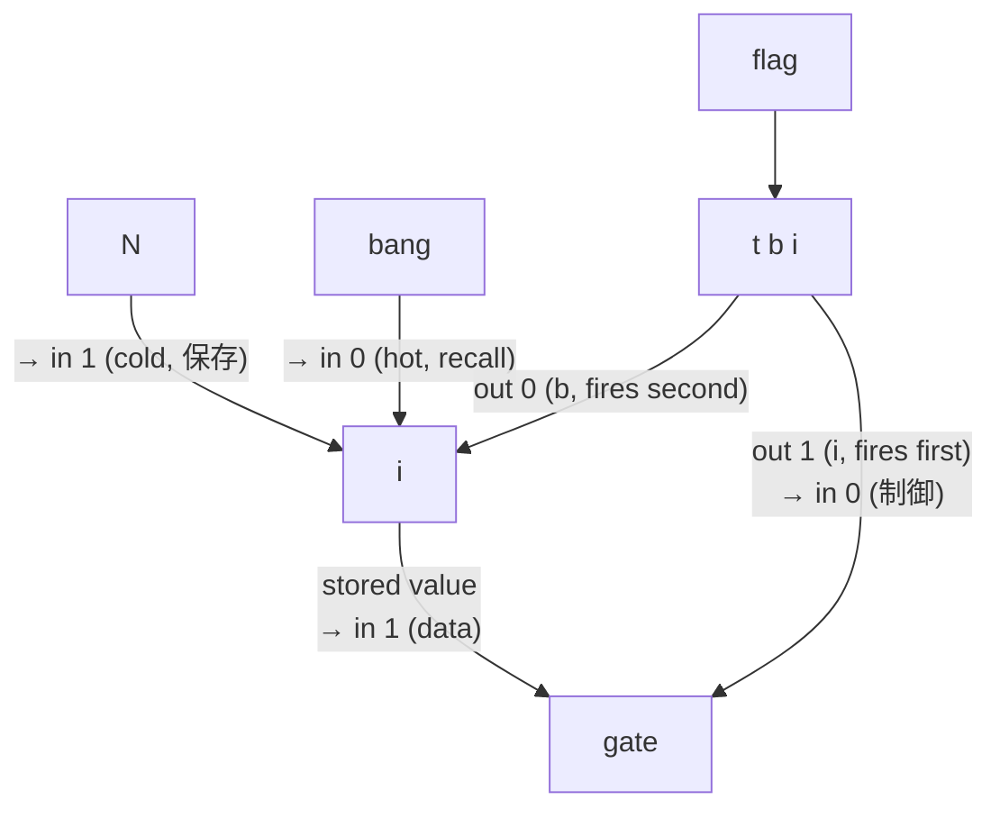
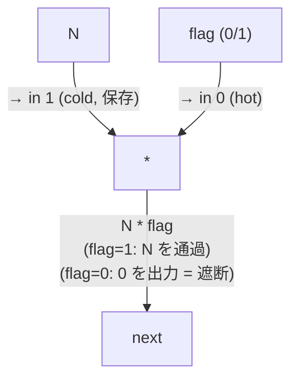

# Object Text Conventions

Max オブジェクトテキストの記述規則と効率的なコーディングパターン。可読性、コンパクトさ、型安全性を確保する。

## 🔴 必読: 適用漏れ防止のためのアンチパターン

以下は Claude が頻繁に犯す誤実装。**`add_max_object` の前後で必ず以下に該当しないかチェックする**。該当する場合は即座に修正する。

### ❌ Anti-pattern 1: 省略形未使用

```
add_max_object obj_type="trigger"  // ← 全名で生成される
add_max_object obj_type="select"   // ← 全名で生成される
add_max_object obj_type="bangbang" // ← 全名で生成される
```

**症状**: パッチが冗長になりレイアウトが崩れる。`trigger b b b b l` で 100px+ の幅を取る。

**正解**: `obj_type` には省略形を直接渡す。

```
add_max_object obj_type="t"        // → "t b b b b l" (40px)
add_max_object obj_type="sel"      // → "sel 1 0"
add_max_object obj_type="b"        // → "b"
add_max_object obj_type="i"        // → "i"
add_max_object obj_type="f"        // → "f"
add_max_object obj_type="s"        // → "s name"
add_max_object obj_type="r"        // → "r name"
```

省略形対応表は Section 1 を参照。**省略形を持つオブジェクトは省略形必須**。

### ❌ Anti-pattern 2: 引数の型未明示

```
add_max_object obj_type="pack" arguments=[0, 0]      // → "pack 0 0" (Int モード)
add_max_object obj_type="pak" arguments=[0, 0]       // → "pak 0 0"
add_max_object obj_type="scale" arguments=[0, 1, 0, 1, 1]  // → Int モード
```

**症状**: Float 値を扱う文脈で Int モードのオブジェクトを使うと、小数点以下が切り捨てられる。range_min/max が常に整数になる、scale 出力が階段状になる等。

**正解**: Float コンテキストでは引数を Float リテラル化:

```
add_max_object obj_type="pak" arguments=[0., 0.]  // → "pak 0. 0."
add_max_object obj_type="scale" arguments=[0., 1., 0., 1., 1.]
```

または `replace_object_text` で text 直書き:

```
replace_object_text new_text="pak 0. 0."
replace_object_text new_text="scale 0. 1. 0. 1. 1. @classic 0"
```

詳細は Section 2 を参照。

### ❌ Anti-pattern 3: 生成後のテキスト未確認

`add_max_object` 後に `get_objects_in_patch` で text を読み戻さず、「指定通り生成された」と仮定して進める。

**症状**:
- `obj_type="trigger"` で生成されたが text が `"trigger b b b b l"` （省略されていない）→ 後で気付くと修正コスト大
- `pak 0 0` のまま放置 → Float が切り捨てられる
- `pattr param_min` で **varname が param_min に強制上書き** されたことに気付かず、後続の `set_object_attribute(varname="pattr_param_min")` が失敗する（実例: 本セッションで発生）

**正解**: `add_max_object` 直後に必ず `get_objects_in_patch` で text を確認。違反があれば `replace_object_text` で即座に修正。

---

## 1. 省略形の使用

**ルール**: 省略形があるオブジェクトは省略形を使用する。

**理由**: パッチの表示がコンパクトになり、オブジェクトの幅が小さくなることでレイアウトの自由度が上がる。

| 正式名 | 省略形 |
|--------|--------|
| `trigger` | `t` |
| `bangbang` | `b` |
| `int` | `i` |
| `float` | `f` |
| `select` | `sel` |
| `send` | `s` |
| `receive` | `r` |

## 2. 引数による型の明示

**ルール**: オブジェクトの引数で初期値を設定する際、意図する動作型（整数 / 実数）を明示する。

**理由**: Max では引数の型がオブジェクトの動作モードを決定する。整数引数 `0` は整数モード、実数引数 `0.` は実数モードで動作する。型を誤ると値の切り捨てや精度の喪失が発生する。

**ルール**:
- 実数で処理するオブジェクトには実数引数を使用する（末尾に `.` を付ける）
- 整数で処理するオブジェクトには整数引数を使用する
- 引数なしのデフォルト状態に頼らず、常に初期値と型を明示する

| 用途 | 誤 | 正 |
|------|-----|-----|
| 実数のべき乗 | `pow 1` | `pow 1.` |
| 実数の範囲変換 | `scale 0 1 0 1` | `scale 0. 1. 0. 1.` |
| 実数の格納 | `pack 0 0` | `pack 0. 0.` |
| 重複排除（初期値 0 通過不要） | `change` | `change 0` |
| 重複排除（初期値 0 通過必要、unsigned） | `change` | `change -1` |
| ゲート（初期閉） | `gate` | `gate 1 0` |

## 3. scale の第5引数によるカーブ変換の統合

**ルール**: `pow` + `scale` でカーブ変換と範囲マッピングを行う場合、`scale` の第5引数（exponent）に統合する。

**理由**: `scale` オブジェクトは第5引数で入力値に指数スケーリング（`x^n`）を適用できる。`pow` と `scale` を別々に使用するより、1つのオブジェクトにまとめた方がパッチが簡潔になる。

**パターン**:

```
誤: input → pow n → scale 0. 1. min max    ← オブジェクト2つ
正: input → scale 0. 1. min max n           ← 1つに統合
```

- 第5引数（inlet 5）で指数 n を動的に設定可能
- modern モード（デフォルト）での計算: `output = out_low + (out_high - out_low) * ((x - in_low) / (in_high - in_low)) ^ n`

## 4. 乗算フィルタパターン

**ルール**: 0/1 フラグで値を条件的に通過/遮断する場合、`gate + i (store/recall)` の代わりに `*` を使用する。

**理由**: `gate` パターンでは store（`i` 右inlet）→ gate 制御設定 → recall（`i` 左inlet）→ gate データ送信 の4ステップが必要で、`t b i` による順序制御も加わる。`*` パターンでは乗算1つで完結し、オブジェクト数と接続数が大幅に削減される。

**パターン**:

**❌ 誤 (gate パターン、4 オブジェクト):**



**✅ 正 (乗算パターン、1 オブジェクト):**



**フラグの生成**: flag (0/1) には論理演算の結果がよく使われる。`!=`, `==`, `>`, `<` 等の比較演算子や `sel` の一致/非一致出力が直接 flag として機能する。

**原理**: 任意の値と 0/1 の乗算で、単純なゲートが実現できる。`gate` + `i` + `t b i` による store/recall/制御の組み合わせより圧倒的に簡潔。
